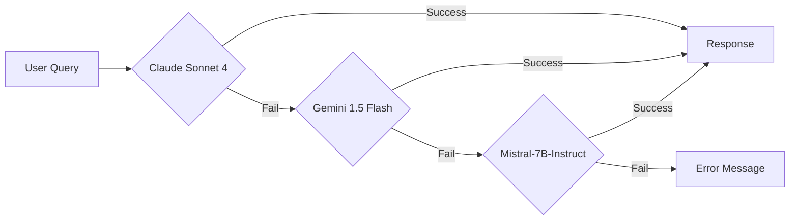

# NLP-Portfolio 프로젝트 최종 기획서 (Product Requirements Document)

> **문서 버전**: v1.1
> **최종 업데이트**: 2026-01-03
> **작성자**: bongseok.sa
> **문서 상태**: 진행 중 (마일스톤 업데이트)

---

## 📋 목차

1. [프로젝트 개요](#1-프로젝트-개요)
2. [프로젝트 목표](#2-프로젝트-목표)
3. [기술 스택](#3-기술-스택)
4. [시스템 아키텍처](#4-시스템-아키텍처)
5. [주요 기능](#5-주요-기능)
6. [데이터 모델](#6-데이터-모델)
7. [배포 및 운영](#7-배포-및-운영)
8. [리스크 관리](#8-리스크-관리)
9. [프로젝트 일정](#9-프로젝트-일정)
10. [기대 효과](#10-기대-효과)

---

## 1. 프로젝트 개요

### 1.1 프로젝트 정의

**NLP-Portfolio**는 복수의 GitHub 리포지토리 코드베이스와 사용자 질의응답 데이터를 자연어로 탐색·분석할 수 있는 **서버리스 기반 NLP 질의응답 시스템**입니다.

### 1.2 핵심 가치 제안

- **Zero Server Cost**: 상시 실행 인프라 없이 완전 서버리스 구조
- **CI-based RAG**: GitHub Actions CI에서 임베딩 생성, 정적 벡터 파일 활용
- **Multi-Repository Analysis**: 여러 레포지토리 동시 분석 지원
- **Continuous Q&A**: 이전 대화 컨텍스트를 활용한 연속 질의응답

### 1.3 타겟 사용자

- 개발자 포트폴리오 방문자
- 기술 면접관 및 채용 담당자
- 프로젝트 코드 리뷰어

### 1.4 비즈니스 목표

1. **포트폴리오 차별화**: 일반 정적 포트폴리오가 아닌 AI 시스템 설계 역량 증명
2. **비용 최적화**: 월 $0 운영비로 실제 서비스 가능한 시스템 구축
3. **기술 스택 다양성**: NLP, RAG, CI/CD, Serverless 기술 통합 경험

---

## 2. 프로젝트 목표

### 2.1 대목표 (Strategic Goals)

- **NLP 기반 질의응답 시스템 구현**
  - 자연어 질문으로 코드베이스 탐색
  - 실시간 답변 생성 (3초 이내)
  - 한국어 우선 지원, 영어 호환

- **프론트엔드 포트폴리오 활용**
  - React 기반 SPA 구조
  - ChatGPT 스타일 UI/UX
  - 반응형 디자인

- **다중 페이지 제공**
  - Q&A 페이지 (메인)
  - 대시보드 페이지 (통계)
  - 설정 페이지 (서버 상태)

### 2.2 중간 목표 (Tactical Goals)

- **서버리스 벡터 검색 시스템**
  - 정적 벡터 파일 (`embeddings.json.gz`) 기반
  - GitHub Raw URL 직접 로드 (CDN 비용 없음)
  - 메모리 캐시 (5분 TTL)

- **다중 GitHub 리포지토리 지원**
  - 대상: `portfolio`, `NLP-portfolio` (2개)
  - `target-repos.json` 설정 파일 기반
  - 증분 업데이트 (신규 커밋만 처리)

- **4가지 데이터 소스 임베딩**
  1. Commit (커밋 메시지 + 메타데이터)
  2. Diff (변경 내역 patch)
  3. File (소스 코드 전체)
  4. Q&A History (이전 질의응답)

- **Supabase 메타데이터 관리**
  - PostgreSQL + pgvector extension
  - Q&A 원문 저장
  - Ping 테이블 (Free Tier 유지)

### 2.3 소목표 (Operational Goals)

- **증분 업데이트 메커니즘**
  - `commit-state.json`으로 중복 방지
  - Idempotent 처리 (재실행 안전성)
  - GitHub Actions Artifacts 활용 (90일 보관)

- **연속 질의응답 지원**
  - 이전 Q&A를 벡터화하여 검색 대상 포함
  - 컨텍스트 누적 기반 대화 흐름

- **CI 자동화**
  - 주간 자동 실행 (매주 토요일 18:00 UTC)
  - 수동 실행 옵션 (`workflow_dispatch`)
  - 실패 시 경고 알림

---

## 3. 기술 스택

### 3.1 프론트엔드

| 카테고리 | 기술 | 버전 | 용도 |
|---------|------|------|------|
| Framework | React | 19+ | UI 컴포넌트 |
| Build Tool | Vite | 5+ | 개발 서버, 번들링 |
| Language | TypeScript | 5+ | 타입 안전성 |
| Styling | PandaCSS | - | CSS-in-JS |
| State | Jotai + TanStack Query | - | 클라이언트/서버 상태 |
| Router | React Router | 6+ | 페이지 라우팅 |

### 3.2 백엔드 (Serverless)

| 카테고리 | 기술 | 비용 | 용도 |
|---------|------|------|------|
| Runtime | Node.js | 무료 | 서버 실행 환경 |
| Framework | Express | 무료 | API 서버 |
| Hosting | Vercel Serverless | 무료 | API 배포 |
| Language | TypeScript (ESM) | 무료 | 타입 안전성 |

### 3.3 AI/ML 스택

#### 임베딩 모델 (CI 전용)
```yaml
Model: sentence-transformers/all-MiniLM-L6-v2
Provider: Hugging Face
Dimensions: 384
Cost: 무료 (GitHub Actions 내 실행)
Environment: GitHub Actions Runner
```

**특징**:
- CI 단계에서만 실행 (로컬/런타임 불가)
- 경량화된 모델 (빠른 처리 속도)
- 다국어 지원 (한국어 포함)

#### 응답 생성 LLM (Fallback Chain)



**우선순위**:
1. **Claude Sonnet 4** (Primary) - 유료, 최고 품질
2. **Gemini 1.5 Flash** (Fallback 1) - 무료, 중간 품질
3. **Mistral-7B-Instruct** (Fallback 2) - 무료, 기본 품질
4. **Error Message** (Final) - "현재 응답을 생성할 수 없습니다"

### 3.4 데이터베이스

```yaml
Primary: Supabase PostgreSQL
Extension: pgvector (벡터 검색)
Tier: Free Tier ($0/month)
Usage:
  - Q&A 원문 저장 (qa_history 테이블)
  - 임베딩 벡터 임시 저장 (CI 단계 전용)
  - Ping 기록 (Free Tier 유지)
```

### 3.5 벡터 저장 방식

```yaml
Storage: GitHub Repository (Static File)
Format: embeddings.json.gz (gzip 압축)
Location: output/ 디렉토리
Access: GitHub Raw URL
Cost: $0 (CDN 비용 없음)
```

**런타임 동작**:
- Vercel Serverless에서 GitHub Raw URL 직접 로드
- 메모리 캐시 (5분 TTL)
- Brute-force cosine similarity 검색

### 3.6 CI/CD

| 도구 | 용도 | 비용 |
|------|------|------|
| GitHub Actions | 임베딩 파이프라인 | 무료 (2,000분/월) |
| Vercel | 프론트엔드 + API 배포 | 무료 (Hobby) |
| pnpm | 패키지 관리 | 무료 |

---

## 4. 시스템 아키텍처

### 4.1 전체 아키텍처 다이어그램

```
┌─────────────────────────────────────────────────────────────────┐
│                        GitHub Actions (CI)                       │
│  ┌──────────────────────────────────────────────────────────┐   │
│  │ 1. Polling Pipeline (매주 토요일 18:00 UTC)              │   │
│  │    - target-repos.json 로드                              │   │
│  │    - 신규 커밋 감지 (commit-state.json 비교)            │   │
│  │    - GitHub API 데이터 수집 (commit, diff, file)        │   │
│  │    - Supabase Q&A 조회                                   │   │
│  │    - Hugging Face 임베딩 생성                            │   │
│  │    - Supabase pgvector 저장                              │   │
│  │    - commit-state.json 업데이트                          │   │
│  └──────────────────────────────────────────────────────────┘   │
│  ┌──────────────────────────────────────────────────────────┐   │
│  │ 2. Export Embeddings (polling 완료 후 자동 실행)        │   │
│  │    - Supabase에서 모든 임베딩 조회                       │   │
│  │    - embeddings.json.gz 생성                             │   │
│  │    - output/ 디렉토리 저장                               │   │
│  │    - Git 커밋 및 푸시 [skip ci]                         │   │
│  └──────────────────────────────────────────────────────────┘   │
│  ┌──────────────────────────────────────────────────────────┐   │
│  │ 3. Supabase Ping (매주 일요일 24:00 KST)                │   │
│  │    - Supabase Health Check                               │   │
│  │    - ping 테이블 기록                                    │   │
│  │    - Free Tier 유지                                      │   │
│  └──────────────────────────────────────────────────────────┘   │
└─────────────────────────────────────────────────────────────────┘
                              │
                              │ Git Push
                              ▼
┌─────────────────────────────────────────────────────────────────┐
│                    GitHub Repository (Storage)                   │
│  ┌──────────────────────────────────────────────────────────┐   │
│  │ output/embeddings.json.gz                                │   │
│  │  - 정적 벡터 파일 (gzip 압축)                           │   │
│  │  - GitHub Raw URL 제공                                   │   │
│  │  - CDN 비용 없음                                         │   │
│  └──────────────────────────────────────────────────────────┘   │
└─────────────────────────────────────────────────────────────────┘
                              │
                              │ HTTPS GET
                              ▼
┌─────────────────────────────────────────────────────────────────┐
│               Vercel Serverless (Runtime)                        │
│  ┌──────────────────────────────────────────────────────────┐   │
│  │ API Server (Express)                                     │   │
│  │  - POST /api/ask (Q&A 엔드포인트)                       │   │
│  │  - GET /api/health (상태 체크)                          │   │
│  │  - GET /api/history (Q&A 히스토리)                      │   │
│  └──────────────────────────────────────────────────────────┘   │
│  ┌──────────────────────────────────────────────────────────┐   │
│  │ Vector Search Engine                                     │   │
│  │  1. embeddings.json.gz 로드 (메모리 캐시 5분)           │   │
│  │  2. 질문 임베딩 생성 (Hugging Face API)                 │   │
│  │  3. Cosine Similarity 계산                               │   │
│  │  4. Top-K 문서 반환                                      │   │
│  └──────────────────────────────────────────────────────────┘   │
│  ┌──────────────────────────────────────────────────────────┐   │
│  │ LLM Fallback Chain                                       │   │
│  │  Claude → Gemini → Mistral → Error                      │   │
│  └──────────────────────────────────────────────────────────┘   │
└─────────────────────────────────────────────────────────────────┘
                              │
                              │ JSON Response
                              ▼
┌─────────────────────────────────────────────────────────────────┐
│                   React Frontend (Vite + Vercel)                │
│  ┌──────────────────────────────────────────────────────────┐   │
│  │ Pages                                                    │   │
│  │  - / (Q&A Page)                                          │   │
│  │  - /dashboard (Analytics)                                │   │
│  │  - /settings (Server Status)                             │   │
│  └──────────────────────────────────────────────────────────┘   │
│  ┌──────────────────────────────────────────────────────────┐   │
│  │ State Management                                         │   │
│  │  - Jotai (Client State)                                  │   │
│  │  - TanStack Query (Server State)                         │   │
│  └──────────────────────────────────────────────────────────┘   │
└─────────────────────────────────────────────────────────────────┘
```

### 4.2 설계 원칙

#### 4.2.1 Zero Server Cost
- ✅ 상시 실행 서버 없음
- ✅ 벡터 DB 서버 운영 없음
- ✅ CDN 비용 없음 (GitHub Raw URL)

#### 4.2.2 CI-First Architecture
- ✅ 임베딩은 CI 단계에서만 수행
- ✅ 런타임은 읽기 전용 구조
- ✅ 정적 파일 기반 배포

#### 4.2.3 환경별 인증 전략

| 환경 | GitHub API 인증 | 설정 필요 여부 |
|------|----------------|--------------|
| **GitHub Actions** | `GITHUB_TOKEN` (자동 제공) | ❌ 불필요 |
| **로컬 개발** | Personal Access Token (수동 생성) | ✅ 필요 (.env) |

---

## 5. 주요 기능

### 5.1 기능 목록 (Feature List)

#### F1. 다중 레포지토리 질의응답
- **설명**: 여러 GitHub 레포지토리 코드를 하나의 질의응답 시스템으로 통합
- **우선순위**: P0 (핵심 기능)
- **상태**: 구현 완료

**사용자 스토리**:
```
AS a 개발자 포트폴리오 방문자
I WANT TO 자연어로 코드베이스에 질문하기
SO THAT 프로젝트 구조와 구현을 빠르게 이해할 수 있다
```

**수용 기준**:
- [ ] `portfolio`, `NLP-portfolio` 2개 레포 동시 검색
- [ ] 질문 입력 후 3초 이내 응답
- [ ] 한국어 질문 지원
- [ ] 소스 코드 인용 제공

#### F2. 연속 질의응답 (Continuous Q&A)
- **설명**: 이전 대화 컨텍스트를 활용한 후속 질문 지원
- **우선순위**: P0 (핵심 기능)
- **상태**: 설계 완료

**사용자 스토리**:
```
AS a 사용자
I WANT TO 이전 대화를 참고한 후속 질문을 하기
SO THAT 자연스러운 대화 흐름으로 정보를 얻을 수 있다
```

**예시**:
```
사용자: "차트는 뭐로 만들어졌어?"
시스템: "Recharts 라이브러리를 사용했습니다."

사용자: "그럼 그 라이브러리 어디서 사용돼?"
시스템: "Recharts는 DashboardPage.tsx에서 사용됩니다."
```

#### F3. 대시보드 (Analytics Dashboard)
- **설명**: Q&A 통계 및 사용 현황 시각화
- **우선순위**: P1 (중요 기능)
- **상태**: 구현 완료

**주요 지표**:
- 총 질문 수
- 성공률 (%)
- 평균 응답 시간 (ms)
- 일별 질문 추이 (Line Chart)
- 카테고리별 분포 (Pie Chart)

#### F4. 증분 업데이트 (Incremental Update)
- **설명**: 신규 커밋만 임베딩하여 비용 절감
- **우선순위**: P0 (핵심 기능)
- **상태**: 구현 완료

**동작 원리**:
1. `commit-state.json`에서 마지막 처리 커밋 SHA 로드
2. GitHub API로 최신 커밋 SHA 조회
3. 신규 커밋만 임베딩 생성
4. `commit-state.json` 업데이트

#### F5. LLM Fallback Chain
- **설명**: 3단계 LLM Fallback으로 가용성 극대화
- **우선순위**: P0 (핵심 기능)
- **상태**: 설계 완료

**Fallback 순서**:
```
Claude Sonnet 4 → Gemini 1.5 Flash → Mistral-7B → Error
```

### 5.2 비기능 요구사항 (Non-Functional Requirements)

#### NFR1. 성능 (Performance)
- **응답 시간**: 95 percentile 3초 이내
- **Cold Start**: 380ms 이내 (파일 로드)
- **Warm Start**: 151ms 이내 (캐시 히트)

#### NFR2. 가용성 (Availability)
- **목표**: 99.5% uptime (주간 기준)
- **Fallback**: 3단계 LLM Fallback
- **모니터링**: Supabase Ping (주간 자동 실행)

#### NFR3. 보안 (Security)
- **API 키 관리**: GitHub Secrets (암호화)
- **환경 변수**: `.env` 파일 (git ignore)
- **접근 제어**: Supabase RLS (Row Level Security)

#### NFR4. 비용 (Cost)
- **목표**: 월 $0 운영비
- **제약**: GitHub Actions 무료 티어 (2,000분/월)
- **최적화**: 증분 업데이트, 캐시 활용

---

## 6. 데이터 모델

### 6.1 벡터 데이터 구조 (`embeddings.json.gz`)

```typescript
interface EmbeddingFile {
  version: string;              // "1.0.0"
  generatedAt: string;          // ISO 8601
  statistics: {
    totalEmbeddings: number;
    commitCount: number;
    fileCount: number;
    qaCount: number;
  };
  embeddings: EmbeddingItem[];
}

interface EmbeddingItem {
  id: string;                   // "commit-{sha}" | "file-{sha}-{index}" | "qa-{id}"
  type: "commit" | "file" | "qa";
  content: string;              // 원본 텍스트
  embedding: number[];          // [384] dimensions
  metadata: CommitMetadata | FileMetadata | QAMetadata;
}
```

### 6.2 Supabase 테이블 스키마

상세 내용은 [03_database/01_Schema.sql](./03_database/01_Schema.sql) 참조

**주요 테이블**:
- `qa_history`: 질의응답 원문
- `embeddings`: 임베딩 벡터 (CI 단계 전용)
- `ping`: Supabase 연결 상태

### 6.3 GitHub Artifacts

#### commit-state.json
```json
{
  "repositories": {
    "username/portfolio": {
      "lastProcessedCommit": "abc123",
      "lastProcessedAt": "2026-01-01T15:00:00Z",
      "totalCommitsProcessed": 150
    }
  },
  "lastUpdated": "2026-01-01T15:10:00Z"
}
```

#### target-repos.json
```json
{
  "repositories": [
    {
      "owner": "username",
      "repo": "portfolio",
      "enabled": true
    }
  ]
}
```

---

## 7. 배포 및 운영

### 7.1 배포 환경

| 환경 | 용도 | URL |
|------|------|-----|
| Production | 실제 서비스 | https://nlp-portfolio.vercel.app |
| Development | 로컬 개발 | http://localhost:5173 |

### 7.2 환경 변수

상세 내용은 [02_architecture/02_Environment_Variables.md](./02_architecture/02_Environment_Variables.md) 참조

### 7.3 모니터링

- **Supabase Dashboard**: 데이터베이스 상태, 쿼리 성능
- **Vercel Dashboard**: API 호출 수, 응답 시간, 에러율
- **GitHub Actions Logs**: CI 파이프라인 실행 이력

### 7.4 백업 전략

- **벡터 파일**: Git 히스토리 (자동 버전 관리)
- **commit-state.json**: GitHub Artifacts (90일 보관)
- **Supabase 데이터**: 자동 백업 (Point-in-Time Recovery)

---

## 8. 리스크 관리

### 8.1 기술적 리스크

| 리스크 | 영향도 | 확률 | 대응 전략 |
|--------|--------|------|----------|
| 벡터 파일 크기 초과 (100MB) | High | Medium | 데이터 유형별 파일 분리, Git LFS |
| CI 실행 시간 초과 (6시간) | Medium | Low | 증분 업데이트, 수동 분할 실행 |
| LLM API 장애 | High | Low | 3단계 Fallback, Mistral-7B 최종 |
| Supabase Free Tier 일시정지 | Medium | Low | Supabase Ping Actions (주간 자동) |

### 8.2 운영 리스크

| 리스크 | 대응 전략 |
|--------|----------|
| GitHub Actions 무료 티어 초과 | 실행 주기 조정 (격주 → 월간) |
| Vercel Bandwidth 제한 | 벡터 파일 외부 스토리지 이전 |
| API 키 노출 | GitHub Secrets, `.env` git ignore |

---

## 9. 프로젝트 일정

### 9.1 마일스톤

| 단계 | 기간 | 주요 목표 | 상태 |
|------|------|----------|------|
| **Milestone 0: 데이터베이스 설정** | 1일 | Supabase 프로젝트 생성 및 스키마 적용 | ✅ 완료 (2026-01-03) |
| **Milestone 1: 로컬 임베딩 파이프라인** | 1주 | 로컬에서 GitHub 데이터 수집 및 임베딩 생성 | ✅ 완료 (2026-01-03) |
| **Milestone 2: CI 단계 임베딩 자동화** | 1주 | GitHub Actions를 통한 임베딩 자동 생성 | ⬜ 진행 예정 |
| **Milestone 3: 서버리스 API 서버** | 1주 | Vercel Serverless Functions 기반 API 서버 | 🔄 진행 중 (Q&A 히스토리 저장 완료) |
| **Milestone 4: 프론트엔드** | 1.5주 | React 19 + Vite + PandaCSS 기반 프론트엔드 | ⬜ 진행 예정 |

**상세 진행 상황**: [프로젝트 마일스톤 문서](./06_milestones/00_Project_Milestones.md) 참조

### 9.2 다음 단계 (Next Steps)

1. ~~**Hugging Face 임베딩 모델 통합**~~ ✅ 완료 (2026-01-03)
   - ~~OpenAI text-embedding-3-small 제거~~ ✅ 완료
   - ~~sentence-transformers/all-MiniLM-L6-v2 적용~~ ✅ 완료
   - ~~CI 파이프라인 테스트~~ ✅ 완료 (로컬 테스트 성공)

2. **Gemini + Mistral LLM Fallback 구현** (Week 7-8)
   - Gemini 1.5 Flash API 연동
   - Mistral-7B-Instruct HuggingFace API 연동
   - Fallback 로직 테스트

3. **성능 테스트 및 최적화** (Week 8)
   - 벡터 검색 속도 측정
   - 캐시 전략 최적화
   - 응답 시간 3초 목표 달성

---

## 10. 기대 효과

### 10.1 기술적 성과

✅ **서버 비용 없이 NLP 시스템 운영**
- GitHub Actions 무료 티어 활용
- Vercel Serverless 무료 티어 활용
- Supabase Free Tier 유지 (Ping 자동화)
- **총 운영비: $0/월**

✅ **서버리스 환경에서 RAG 구조 구현**
- 정적 벡터 파일 기반 검색
- 메모리 캐시로 성능 최적화
- Cold Start 380ms, Warm Start 151ms

✅ **CI 기반 임베딩 파이프라인 설계 경험**
- GitHub Actions 워크플로우 설계
- 증분 업데이트 메커니즘 구현
- Idempotent 처리 (재실행 안전성)

✅ **AI 시스템 설계 역량 증명**
- 임베딩·검색·응답 생성의 역할 분리
- 3단계 Fallback 전략 설계
- 다중 레포지토리 동시 분석

### 10.2 포트폴리오 가치

✅ **차별화된 기술 스택**
- NLP, RAG, CI/CD, Serverless 통합
- Hugging Face 오픈소스 모델 활용
- 비용 최적화 아키텍처

✅ **실제 운영 가능한 시스템**
- 월 $0 운영비
- 99.5% uptime 목표
- 실시간 질의응답 (3초 이내)

✅ **명확한 설계 판단 근거**
- Zero Server Cost 원칙
- CI-First Architecture
- 환경별 인증 전략

---

## 📚 관련 문서

- [프로젝트 마일스톤](./06_milestones/00_Project_Milestones.md) ⭐
- [아키텍처 상세 설계](./02_architecture/01_System_Architecture.md)
- [데이터베이스 스키마](./03_database/00_Schema_Documentation.md)
- [GitHub Actions 워크플로우](./04_ci-cd/01_Workflows.md)
- [API 명세서](./05_api/ADR-001-Additional-API-Endpoints.md)

---

## 📝 변경 이력

| 버전 | 날짜 | 변경 내용 | 작성자 |
|------|------|----------|--------|
| v1.1 | 2026-01-03 | 마일스톤 진행 상황 반영 (M0, M1 완료, M3 진행 중) | bongseok.sa |
| v1.0 | 2026-01-03 | 최초 작성 | bongseok.sa |

---

**문서 작성 완료 일시**: 2026-01-03 10:30 KST
