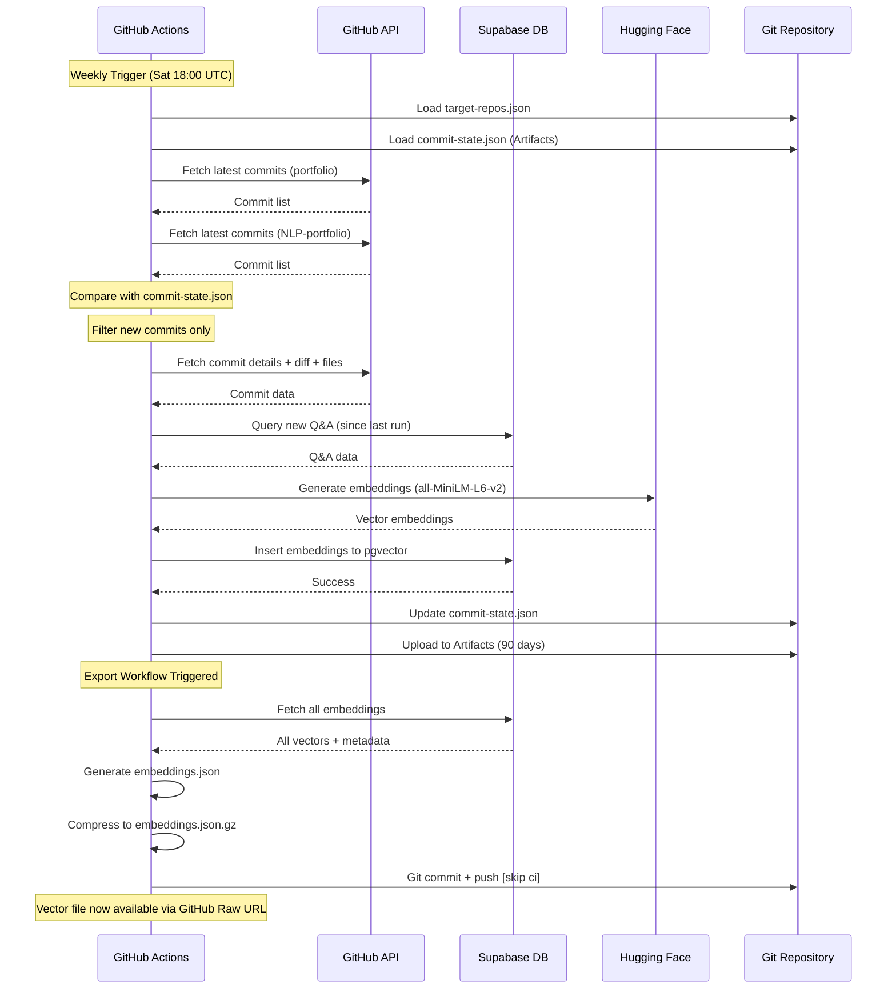
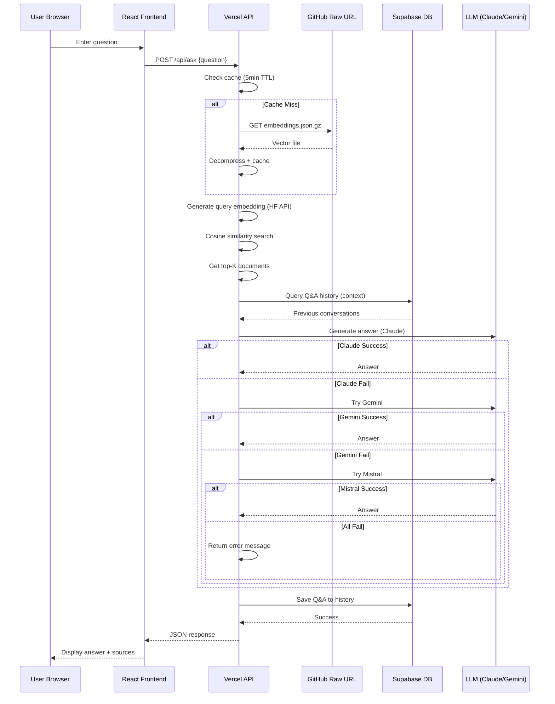

# 시스템 아키텍처 상세 설계

> **문서 버전**: v1.0
> **최종 업데이트**: 2026-01-03

---

## 목차

1. [설계 원칙](#1-설계-원칙)
2. [시스템 구성도](#2-시스템-구성도)
3. [데이터 흐름](#3-데이터-흐름)
4. [환경별 인증 전략](#4-환경별-인증-전략)
5. [벡터 저장 아키텍처](#5-벡터-저장-아키텍처)
6. [LLM Fallback 아키텍처](#6-llm-fallback-아키텍처)

---

## 1. 설계 원칙

### 1.1 Zero Server Cost

**목표**: 상시 실행 인프라 없이 완전 서버리스 구조

**구현**:
- ✅ 벡터 DB 서버 운영 없음 → 정적 파일 사용
- ✅ CDN 비용 없음 → GitHub Raw URL 활용
- ✅ 캐시 서버 없음 → 메모리 캐시 활용

### 1.2 CI-First Architecture

**목표**: 임베딩 생성을 CI 단계로 제한

**구현**:
- ✅ 임베딩은 GitHub Actions에서만 실행
- ✅ 런타임은 읽기 전용 구조
- ✅ 정적 파일 기반 배포

### 1.3 Incremental Update

**목표**: 신규 데이터만 처리하여 비용 절감

**구현**:
- ✅ `commit-state.json`으로 중복 방지
- ✅ Idempotent 처리 (재실행 안전성)
- ✅ GitHub Actions Artifacts 활용

---

## 2. 시스템 구성도

### 2.1 컴포넌트 다이어그램

```
┌─────────────────────────────────────────────────────────┐
│                   User Interface Layer                   │
├─────────────────────────────────────────────────────────┤
│  React Frontend (Vercel Hosting)                        │
│  - Q&A Page (/)                                          │
│  - Dashboard (/dashboard)                                │
│  - Settings (/settings)                                  │
│                                                          │
│  State Management:                                       │
│  - Jotai (Client State)                                  │
│  - TanStack Query (Server State)                         │
└─────────────────────────────────────────────────────────┘
                        │ HTTPS
                        ▼
┌─────────────────────────────────────────────────────────┐
│                  API Gateway Layer                       │
├─────────────────────────────────────────────────────────┤
│  Vercel Serverless Functions                            │
│  - POST /api/ask                                         │
│  - GET /api/health                                       │
│  - GET /api/history                                      │
└─────────────────────────────────────────────────────────┘
                        │
        ┌───────────────┼───────────────┐
        ▼               ▼               ▼
┌──────────────┐ ┌──────────────┐ ┌──────────────┐
│ Vector Store │ │  LLM Service │ │   Database   │
├──────────────┤ ├──────────────┤ ├──────────────┤
│ GitHub Raw   │ │ Claude API   │ │  Supabase    │
│ embeddings   │ │ Gemini API   │ │  PostgreSQL  │
│ .json.gz     │ │ Mistral API  │ │  + pgvector  │
└──────────────┘ └──────────────┘ └──────────────┘
        ▲                               ▲
        │                               │
        │          ┌────────────────────┘
        │          │
┌─────────────────────────────────────────────────────────┐
│                  CI/CD Pipeline Layer                    │
├─────────────────────────────────────────────────────────┤
│  GitHub Actions                                          │
│  1. Polling Pipeline (weekly)                            │
│  2. Export Embeddings (after polling)                    │
│  3. Supabase Ping (weekly)                               │
└─────────────────────────────────────────────────────────┘
```

### 2.2 배포 아키텍처

```
┌─────────────────────────────────────────────────────────┐
│                    Production Env                        │
│                                                          │
│  ┌────────────────┐         ┌────────────────┐          │
│  │ Vercel CDN     │◄────────│ GitHub Pages   │          │
│  │ (Frontend)     │         │ (Static Assets)│          │
│  └────────────────┘         └────────────────┘          │
│          │                                               │
│          ▼                                               │
│  ┌────────────────┐         ┌────────────────┐          │
│  │ Vercel Edge    │◄────────│ GitHub Raw URL │          │
│  │ (Serverless)   │         │ (Vector File)  │          │
│  └────────────────┘         └────────────────┘          │
│          │                                               │
│          ▼                                               │
│  ┌────────────────┐         ┌────────────────┐          │
│  │ Supabase       │         │ Claude/Gemini  │          │
│  │ (Database)     │         │ (LLM APIs)     │          │
│  └────────────────┘         └────────────────┘          │
└─────────────────────────────────────────────────────────┘
```

---

## 3. 데이터 흐름

### 3.1 CI Pipeline (Offline)



### 3.2 Runtime Flow (Online)



---

## 4. 환경별 인증 전략

### 4.1 GitHub Actions (CI 환경)

```yaml
# .github/workflows/polling-embed.yml
env:
  GITHUB_TOKEN: ${{ secrets.GITHUB_TOKEN }}  # ✅ 자동 제공
```

**특징**:
- GitHub Actions가 워크플로우 실행 시 자동 생성
- 해당 레포지토리 및 같은 owner의 레포지토리 접근 가능
- 워크플로우 종료 시 자동 만료
- **GitHub Secrets 설정 불필요**

**접근 가능 범위**:
- ✅ `NLP-portfolio` (현재 레포지토리)
- ✅ `portfolio` (같은 owner의 다른 레포지토리)
- ✅ Public 레포지토리 읽기
- ✅ Private 레포지토리 읽기 (owner 일치 시)

### 4.2 로컬 개발 환경

```bash
# .env
GITHUB_TOKEN=ghp_xxxxxxxxxxxxx  # Personal Access Token 필요
TARGET_REPO_OWNER=username
TARGET_REPO_NAME=portfolio
```

**특징**:
- 개발자가 직접 Personal Access Token (PAT) 생성 필요
- GitHub Settings → Developer settings → Personal access tokens
- 권한: `repo` (Full control of private repositories)
- `.env` 파일에 수동 추가

**접근 가능 범위**:
- ✅ PAT 생성자가 접근 가능한 모든 레포지토리
- ✅ Public/Private 레포지토리 읽기
- ✅ 권한에 따라 쓰기 가능

**로컬 임베딩 파이프라인 실행**:
```bash
# 일반 모드 (증분 업데이트, 새 커밋만 처리)
pnpm run embed

# 리셋 모드 (전체 재생성, 모든 커밋 재처리)
pnpm run embed:reset
```

**동작 과정**:
1. `target-repos.json`에서 대상 레포지토리 목록 읽기
2. GitHub API로 커밋 목록 가져오기 (증분 업데이트: 마지막 처리 커밋 이후만)
3. GitHub API로 레포지토리 파일 목록 가져오기
4. Hugging Face 모델로 임베딩 생성 (`all-MiniLM-L6-v2`, 384차원)
   - 커밋 메시지 임베딩 (최대 100개)
   - 파일 내용 임베딩 (최대 200개, 5KB 이하)
5. Supabase pgvector에 저장 (배치 처리, 100개씩)
6. `commit-state.json`에 마지막 커밋 SHA 저장 (다음 실행 시 증분 업데이트)

### 4.3 코드 레벨 분기 처리

```typescript
// src/embedding-pipeline/data_sources/github/client.ts
import { Octokit } from "@octokit/rest";

// 환경에 따라 자동으로 올바른 토큰 사용
const githubToken = process.env.GITHUB_TOKEN;

if (!githubToken) {
  throw new Error(
    "GITHUB_TOKEN is required. " +
    "CI: Automatically provided by GitHub Actions. " +
    "Local: Add Personal Access Token to .env file"
  );
}

const octokit = new Octokit({
  auth: githubToken,
});

export { octokit };
```

**환경 감지 로직** (선택적):
```typescript
const isCI = process.env.CI === "true" || process.env.GITHUB_ACTIONS === "true";

if (isCI) {
  console.log("🔄 Running in CI: Using GitHub Actions token");
} else {
  console.log("💻 Running locally: Using Personal Access Token");

  if (!process.env.GITHUB_TOKEN?.startsWith("ghp_")) {
    console.warn("⚠️  Local token should start with 'ghp_'");
  }
}
```

---

## 5. 벡터 저장 아키텍처

### 5.1 파일 기반 벡터 저장

**저장 위치**: GitHub Repository (`output/embeddings.json.gz`)

**구조**:
```typescript
interface EmbeddingFile {
  version: string;
  generatedAt: string;
  statistics: {
    totalEmbeddings: number;
    commitCount: number;
    fileCount: number;
    qaCount: number;
  };
  embeddings: EmbeddingItem[];
}
```

**장점**:
- ✅ CDN 비용 없음 (GitHub Raw URL 무료)
- ✅ Git 버전 관리 (자동 백업)
- ✅ 배포 간단 (Git push만)

**단점**:
- ❌ 파일 크기 제한 (100MB)
- ❌ 실시간 업데이트 불가 (CI 주기에 의존)

### 5.2 메모리 캐시 전략

```typescript
// src/service/vector-store/fileVectorStore.ts
const CACHE_TTL = 5 * 60 * 1000; // 5분

let cache: {
  data: EmbeddingFile | null;
  loadedAt: number;
} = {
  data: null,
  loadedAt: 0
};

export async function loadVectorFile(): Promise<EmbeddingFile> {
  const now = Date.now();

  // 캐시 히트
  if (cache.data && now - cache.loadedAt < CACHE_TTL) {
    console.log("✅ Cache hit (warm start)");
    return cache.data;
  }

  // 캐시 미스
  console.log("⚠️  Cache miss (cold start)");
  const response = await fetch(VECTOR_FILE_URL);
  const compressed = await response.arrayBuffer();
  const decompressed = await gunzip(compressed);
  const data = JSON.parse(decompressed);

  cache = { data, loadedAt: now };

  return data;
}
```

**성능**:
- **Cold Start**: 150-380ms (파일 로드 + 압축 해제)
- **Warm Start**: 51-151ms (캐시 히트)

---

## 6. LLM Fallback 아키텍처

### 6.1 3단계 Fallback Chain

```typescript
// src/service/qa/answer.ts
export async function generateAnswer(
  query: string,
  context: SearchResult[]
): Promise<string> {
  const contextText = buildContext(context);

  // 1차 시도: Claude Sonnet 4
  if (claudeApiKey) {
    try {
      console.log("🔄 Generating answer with Claude Sonnet 4...");
      const answer = await generateWithClaude(query, contextText);
      console.log("✅ Claude answer generation successful");
      return answer;
    } catch (error) {
      console.warn("⚠️ Claude failed:", error.message);
      console.log("🔄 Falling back to Gemini...");
    }
  }

  // 2차 시도: Gemini 1.5 Flash
  if (geminiApiKey) {
    try {
      console.log("🔄 Generating answer with Gemini 1.5 Flash...");
      const answer = await generateWithGemini(query, contextText);
      console.log("✅ Gemini answer generation successful");
      return answer;
    } catch (error) {
      console.warn("⚠️ Gemini failed:", error.message);
      console.log("🔄 Falling back to Mistral...");
    }
  }

  // 3차 시도: Mistral-7B-Instruct
  if (huggingfaceApiKey) {
    try {
      console.log("🔄 Generating answer with Mistral-7B-Instruct...");
      const answer = await generateWithMistral(query, contextText);
      console.log("✅ Mistral answer generation successful");
      return answer;
    } catch (error) {
      console.error("❌ Mistral failed:", error.message);
    }
  }

  // 최종 실패
  return "현재 응답을 생성할 수 없습니다. 잠시 후 다시 시도해주세요.";
}
```

### 6.2 비용 최적화 전략

| LLM | 용도 | 비용 | 예상 사용률 |
|-----|------|------|------------|
| **Claude Sonnet 4** | 고품질 응답 필요 시 | $3/1M input | 60% |
| **Gemini 1.5 Flash** | 일반 질문 처리 | 무료 (15 RPM) | 35% |
| **Mistral-7B** | 긴급 fallback | 무료 | 5% |

**목표**:
- Claude 사용 최소화 → 월 $5 이하 유지
- Gemini Free tier 우선 활용
- Mistral은 최종 안전망

---

## 📚 관련 문서

- [환경 변수 설정](./02_Environment_Variables.md)
- [데이터베이스 스키마](../03_database/01_Schema.sql)
- [GitHub Actions 워크플로우](../04_ci-cd/01_Workflows.md)

---

**문서 작성 완료**: 2026-01-03 10:35 KST
