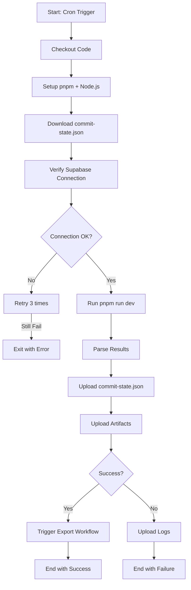

# GitHub Actions 워크플로우 문서

> **문서 버전**: v1.0
> **최종 업데이트**: 2026-01-03

---

## 목차

1. [워크플로우 개요](#1-워크플로우-개요)
2. [Polling-based Embedding Pipeline](#2-polling-based-embedding-pipeline)
3. [Export Embeddings](#3-export-embeddings)
4. [Supabase Ping](#4-supabase-ping)
5. [트러블슈팅](#5-트러블슈팅)

---

## 1. 워크플로우 개요

### 1.1 전체 워크플로우 맵

```
┌─────────────────────────────────────────────────────────┐
│  1. Polling Pipeline (매주 토 18:00 UTC)               │
│     - 신규 커밋 감지                                     │
│     - 임베딩 생성                                        │
│     - Supabase 저장                                      │
│     - commit-state.json 업데이트                         │
└─────────────────────────────────────────────────────────┘
                        │ workflow_run (on success)
                        ▼
┌─────────────────────────────────────────────────────────┐
│  2. Export Embeddings (polling 완료 후 자동 실행)      │
│     - Supabase에서 전체 임베딩 조회                      │
│     - embeddings.json.gz 생성                            │
│     - Git 커밋 및 푸시                                   │
└─────────────────────────────────────────────────────────┘

┌─────────────────────────────────────────────────────────┐
│  3. Supabase Ping (매주 일 24:00 KST)                  │
│     - Supabase Health Check                              │
│     - ping 테이블 기록                                   │
│     - Free Tier 유지                                     │
└─────────────────────────────────────────────────────────┘
```

### 1.2 파일 위치

```
.github/workflows/
├── polling-embed.yml        # Embedding Pipeline
├── export-embeddings.yml    # Vector File Export
└── supabase-ping.yml         # Supabase Ping
```

---

## 2. Polling-based Embedding Pipeline

### 2.1 파일: `polling-embed.yml`

**목적**: 주기적으로 다중 레포지토리를 폴링하여 신규 커밋 감지 및 임베딩 생성

**트리거**:
```yaml
on:
  schedule:
    - cron: "0 18 * * 6"  # 매주 토요일 18:00 UTC (일요일 03:00 KST)
  workflow_dispatch:       # 수동 실행 가능
```

**주요 단계**:
1. **환경 설정**
   - Node.js 20, pnpm 10.17.1
   - Dependencies 캐시
   - 이전 commit-state.json 복원 (Artifacts)

2. **Supabase 연결 확인**
   - Health Check (retry 3회)
   - HTTP 200-299 응답 확인

3. **파이프라인 실행**
   - `pnpm run dev` (일반 모드)
   - `pnpm run dev --reset` (reset 모드 - 수동 실행 시만)

4. **결과 저장**
   - commit-state.json → GitHub Artifacts (90일 보관)
   - refined_data.json → Artifacts (30일 보관, 디버깅용)
   - pipeline.log → Artifacts (7일 보관, 실패 시만)

**환경 변수**:
```yaml
env:
  GITHUB_TOKEN: ${{ secrets.GITHUB_TOKEN }}  # 자동 제공
  OPENAI_API_KEY: ${{ secrets.OPENAI_API_KEY }}  # 향후 제거 예정
  SUPABASE_URL: ${{ secrets.SUPABASE_URL }}
  SUPABASE_SERVICE_ROLE_KEY: ${{ secrets.SUPABASE_SERVICE_ROLE_KEY }}
```

**동시 실행 방지**:
```yaml
concurrency:
  group: embedding-pipeline-${{ github.ref }}
  cancel-in-progress: true
```

**Timeout**: 5시간 (GitHub Actions 무료 티어: 6시간)

### 2.2 처리 흐름



### 2.3 수동 실행 (workflow_dispatch)

**GitHub Actions UI**:
```
Actions → Polling-based Embedding Pipeline → Run workflow
```

**옵션**:
- `reset`: 전체 commit state 리셋 후 재임베딩 (주의: 시간 소요)

**사용 시나리오**:
- 임베딩 모델 변경 후 전체 재임베딩 필요 시
- commit-state.json 손상 시
- 테스트 목적

---

## 3. Export Embeddings

### 3.1 파일: `export-embeddings.yml`

**목적**: Supabase에 저장된 임베딩을 파일로 내보내기

**트리거**:
```yaml
on:
  workflow_run:
    workflows: ["Polling-based Embedding Pipeline"]
    types: [completed]
  workflow_dispatch:
  schedule:
    - cron: '30 0 * * *'  # 매일 0:30 UTC (선택적)
```

**주요 단계**:
1. **Supabase 연결 확인**
   - `/rest/v1/embeddings?select=count` 조회

2. **Export 실행**
   - `pnpm tsx scripts/export-embeddings.ts --source supabase --output output/embeddings.json.gz`

3. **파일 검증**
   - 파일 존재 확인
   - 최소 크기 1KB 이상
   - JSON 구조 검증 (`jq '.embeddings | length'`)

4. **Git 커밋 및 푸시**
   - `[skip ci]` 플래그로 무한 루프 방지
   - 변경사항이 있을 때만 커밋

**동시 실행 방지**:
```yaml
concurrency:
  group: export-embeddings
  cancel-in-progress: false  # 실행 중이면 대기
```

### 3.2 Git 커밋 메시지 예시

```
chore: Update embeddings [skip ci]

- Generated: Run #123
- Embeddings: 4,567
- File size: 1,234,567 bytes
- Triggered by: workflow_run
```

### 3.3 파일 검증 로직

```bash
# 파일 존재 확인
[ ! -f "output/embeddings.json.gz" ] && exit 1

# 크기 확인
size=$(stat -f%z "output/embeddings.json.gz")
[ "$size" -lt 1024 ] && exit 1

# JSON 구조 확인
count=$(zcat output/embeddings.json.gz | jq '.embeddings | length')
echo "Embeddings: $count"
```

---

## 4. Supabase Ping

### 4.1 파일: `supabase-ping.yml`

**목적**: Supabase Free Tier 7일 비활성 방지

**트리거**:
```yaml
on:
  schedule:
    - cron: '0 15 * * 0'  # 매주 일요일 24:00 KST (UTC 15:00)
  workflow_dispatch:
```

**주요 단계**:
1. **Health Check**
   - `GET /rest/v1/` (Supabase REST API)
   - 응답 시간 측정

2. **Ping 기록**
   - `POST /rest/v1/ping` (ping 테이블에 저장)
   - 성공/실패 상태 기록

**Node.js 스크립트** (inline):
```javascript
const startTime = Date.now();
const supabaseUrl = process.env.SUPABASE_URL;
const apiKey = process.env.SUPABASE_SERVICE_ROLE_KEY;

fetch(supabaseUrl + '/rest/v1/', {
  headers: {
    'apikey': apiKey,
    'Authorization': 'Bearer ' + apiKey
  }
})
.then(async (res) => {
  const responseTime = Date.now() - startTime;
  const status = res.ok ? 'success' : 'error';

  // ping 테이블에 저장
  return fetch(supabaseUrl + '/rest/v1/ping', {
    method: 'POST',
    headers: {
      'apikey': apiKey,
      'Authorization': 'Bearer ' + apiKey,
      'Content-Type': 'application/json',
      'Prefer': 'return=minimal'
    },
    body: JSON.stringify({
      status,
      http_code: res.status,
      response_time_ms: responseTime,
      triggered_by: 'github_actions'
    })
  });
});
```

### 4.2 실패 시 알림

```yaml
- name: Notify on failure
  if: failure()
  run: |
    echo "::warning::Supabase ping check failed. Please check the logs."
```

**GitHub Actions UI에 경고 표시됨**

---

## 5. 트러블슈팅

### 5.1 Polling Pipeline 실패

#### 문제: Supabase 연결 실패
```
❌ Supabase connection failed (HTTP 403)
```

**원인**:
- `SUPABASE_SERVICE_ROLE_KEY` 만료 또는 잘못됨
- Supabase 프로젝트 일시정지

**해결**:
1. Supabase Dashboard에서 키 확인
2. GitHub Secrets 업데이트
3. Supabase 프로젝트 상태 확인

#### 문제: CI Timeout (5시간 초과)
```
Error: The operation was canceled.
```

**원인**:
- 너무 많은 신규 커밋 (증분 업데이트 실패)

**해결**:
1. 수동 실행 후 reset 모드 비활성화
2. `commit-state.json` 최신 커밋으로 수동 업데이트
3. 대량 커밋 발생 시 분할 실행

### 5.2 Export 실패

#### 문제: embeddings.json.gz 생성 안 됨
```
❌ Export file not found
```

**원인**:
- Supabase 연결 실패
- TypeScript 컴파일 에러

**해결**:
1. `export.log` Artifacts 다운로드
2. 에러 로그 확인
3. 로컬에서 `pnpm tsx scripts/export-embeddings.ts` 테스트

#### 문제: Git 푸시 실패
```
fatal: could not read Username for 'https://github.com'
```

**원인**:
- `GITHUB_TOKEN` 권한 부족

**해결**:
1. Workflow 권한 확인: Settings → Actions → General → Workflow permissions
2. "Read and write permissions" 활성화

### 5.3 Supabase Ping 실패

#### 문제: Ping 테이블에 저장 안 됨
```
❌ Failed to record ping: 404
```

**원인**:
- `ping` 테이블 미생성

**해결**:
1. Supabase SQL Editor에서 스키마 실행: `docs/03_database/01_Schema.sql`
2. 테이블 존재 확인: `SELECT * FROM ping LIMIT 1;`

---

## 6. 모니터링

### 6.1 워크플로우 실행 이력

```
Repository → Actions → 워크플로우 선택
```

**확인 항목**:
- ✅ 최근 실행 성공 여부
- ⏱️ 실행 시간 (평균 30분 ~ 2시간)
- 📊 Artifacts 생성 여부

### 6.2 Artifacts 확인

**Polling Pipeline**:
- `commit-state` (90일 보관)
- `refined-data-{run_number}` (30일 보관)
- `pipeline-logs-{run_number}` (7일 보관, 실패 시만)

**Export Embeddings**:
- `embeddings-{run_number}` (30일 보관)
- `export-logs-{run_number}` (7일 보관, 실패 시만)

---

## 📚 관련 문서

- [시스템 아키텍처](../02_architecture/01_System_Architecture.md)
- [환경 변수 설정](../02_architecture/02_Environment_Variables.md)
- [데이터베이스 스키마](../03_database/01_Schema.sql)

---

**문서 작성 완료**: 2026-01-03 10:50 KST
