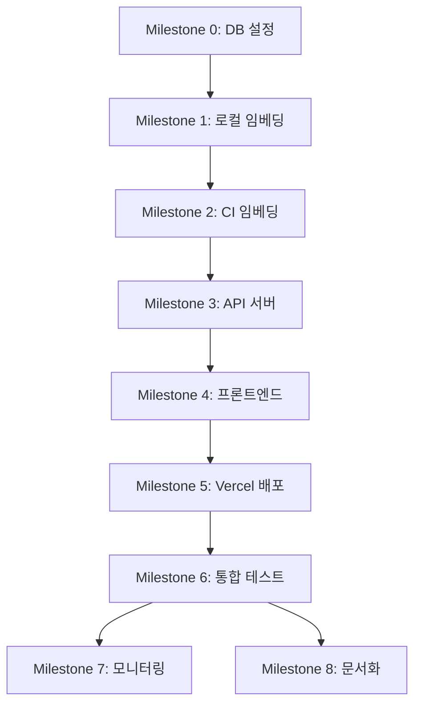

# 프로젝트 마일스톤

> **문서 버전**: v1.0
> **최종 업데이트**: 2026-01-03
> **프로젝트**: NLP-Portfolio

---

## 목차

1. [마일스톤 개요](#1-마일스톤-개요)
2. [Milestone 0: 데이터베이스 설정](#milestone-0-데이터베이스-설정)
3. [Milestone 1: 로컬 임베딩 파이프라인](#milestone-1-로컬-임베딩-파이프라인)
4. [Milestone 2: CI 단계 임베딩 자동화](#milestone-2-ci-단계-임베딩-자동화)
5. [Milestone 3: 서버리스 API 서버](#milestone-3-서버리스-api-서버)
6. [Milestone 4: 프론트엔드](#milestone-4-프론트엔드)
7. [Milestone 5: Vercel 배포](#milestone-5-vercel-배포)
8. [Milestone 6: 통합 테스트](#milestone-6-통합-테스트)
9. [Milestone 7: 모니터링](#milestone-7-모니터링)
10. [Milestone 8: 문서화](#milestone-8-문서화)

---

## 1. 마일스톤 개요

### 프로젝트 목표
GitHub 레포지토리 분석을 위한 NLP/RAG 기반 질의응답 시스템 구축

### 전체 일정
- **예상 기간**: 8주
- **핵심 원칙**: Zero Server Cost, CI-First Architecture

### 의존성 관계

---

## Milestone 0: 데이터베이스 설정

**목표**: Supabase 프로젝트 생성 및 스키마 적용

**예상 기간**: 1일

### 작업 항목

#### 1. Supabase 프로젝트 생성
- [ ] Supabase 계정 생성
- [ ] 새 프로젝트 생성 (Free Tier)
- [ ] 프로젝트 URL 및 API 키 확인
- [ ] `.env` 파일 설정

#### 2. 스키마 적용
- [ ] `00_init.sql` 실행 (pgvector extension)
- [ ] `qa_history` 테이블 생성
- [ ] `embeddings` 테이블 생성
- [ ] `ping` 테이블 생성
- [ ] `commit_state` 테이블 생성

#### 3. RLS 정책 검증
- [ ] Service Role Key로 전체 접근 테스트
- [ ] Anon Key로 qa_history 읽기 테스트
- [ ] 권한 오류 케이스 확인

#### 4. API 키 발급
- [ ] `SUPABASE_SERVICE_ROLE_KEY` 복사
- [ ] `SUPABASE_ANON_KEY` 복사
- [ ] GitHub Secrets 등록

### 완료 조건
- ✅ Supabase 프로젝트 정상 동작
- ✅ 모든 테이블 생성 완료
- ✅ RLS 정책 검증 통과
- ✅ 환경 변수 설정 완료

### 관련 문서
- [데이터베이스 스키마](../03_database/00_Schema_Documentation.md)
- [환경 변수 설정](../02_architecture/02_Environment_Variables.md)

---

## Milestone 1: 로컬 임베딩 파이프라인

**목표**: 로컬에서 GitHub 데이터를 수집하고 임베딩 생성

**예상 기간**: 1주

### 작업 항목

#### 1. GitHub 데이터 수집
- [ ] Octokit 클라이언트 설정
- [ ] 커밋 목록 가져오기 (`fetchAllCommits`)
- [ ] 커밋별 변경 파일 가져오기 (`fetchFiles` with patch/diff)
- [ ] 레포지토리 전체 소스 파일 가져오기 (`fetchRepositoryFiles`)
- [ ] 파일 필터링 (node_modules, .git, dist 제외)

#### 2. 데이터 정제
- [ ] 커밋 메시지 + diff 결합 (`preprocessText`)
- [ ] 파일별 청크 분할 (>5KB 파일)
- [ ] NLP 친화적 포맷 변환
- [ ] 메타데이터 구조화

#### 3. 임베딩 생성
- [ ] sentence-transformers/all-MiniLM-L6-v2 모델 로드
- [ ] 커밋 임베딩 생성 (384 dimensions)
- [ ] 파일 임베딩 생성
- [ ] 배치 처리 구현 (메모리 최적화)

#### 4. Supabase 저장
- [ ] `embeddings` 테이블에 벡터 저장
- [ ] 중복 처리 (UPSERT)
- [ ] 에러 핸들링 및 재시도
- [ ] 저장 진행률 로깅

#### 5. 로컬 테스트
- [ ] `pnpm run dev` 실행
- [ ] 2개 레포지토리 임베딩 확인
- [ ] 벡터 검색 정확도 검증
- [ ] 성능 측정 (시간, 메모리)

### 완료 조건
- ✅ 2개 레포지토리 임베딩 완료 (portfolio, NLP-portfolio)
- ✅ Supabase에 5,000+ 벡터 저장
- ✅ 벡터 검색 Top-K 정상 동작
- ✅ 로컬 파이프라인 안정성 확인

### 관련 문서
- [시스템 아키텍처](../02_architecture/01_System_Architecture.md)
- [CLAUDE.md - Data Pipeline](../../CLAUDE.md#data-flow)

---

## Milestone 2: CI 단계 임베딩 자동화

**목표**: GitHub Actions를 통한 임베딩 자동 생성 및 export

**예상 기간**: 1주

### 작업 항목

#### 1. GitHub Actions 워크플로우 작성
- [ ] `polling-embed.yml` 생성
- [ ] 스케줄 트리거 설정 (매주 토요일 18:00 UTC)
- [ ] 수동 실행 (workflow_dispatch) 지원
- [ ] 타임아웃 설정 (5시간)

#### 2. 증분 업데이트 구현
- [ ] `commit-state.json` 로드/저장
- [ ] 마지막 처리 커밋 이후만 fetch
- [ ] Idempotent 처리 (재실행 안전)
- [ ] GitHub Artifacts 업로드 (90일 보관)

#### 3. Supabase 연결
- [ ] GitHub Secrets 설정
- [ ] Supabase Health Check
- [ ] 연결 실패 시 재시도 (3회)
- [ ] 타임아웃 처리

#### 4. Embeddings Export
- [ ] `export-embeddings.yml` 워크플로우 작성
- [ ] Supabase에서 전체 임베딩 조회
- [ ] `embeddings.json.gz` 생성
- [ ] 파일 검증 (크기, JSON 구조)
- [ ] Git 커밋 및 푸시 (`[skip ci]`)

#### 5. Supabase Ping
- [ ] `supabase-ping.yml` 워크플로우 작성
- [ ] 스케줄 설정 (매주 일요일 24:00 KST)
- [ ] Health Check API 호출
- [ ] `ping` 테이블 기록
- [ ] 실패 시 알림

#### 6. 워크플로우 테스트
- [ ] 수동 실행 테스트
- [ ] 증분 업데이트 검증
- [ ] export 파일 생성 확인
- [ ] 에러 케이스 테스트

### 완료 조건
- ✅ 3개 워크플로우 정상 동작
- ✅ `embeddings.json.gz` 자동 생성
- ✅ 증분 업데이트 정상 작동
- ✅ Supabase Free Tier 유지 (Ping 성공)

### 관련 문서
- [CI/CD 워크플로우](../04_ci-cd/01_Workflows.md)
- [환경 변수 설정](../02_architecture/02_Environment_Variables.md)

---

## Milestone 3: 서버리스 API 서버

**목표**: Vercel Serverless Functions 기반 API 서버 구축

**예상 기간**: 1주

### 작업 항목

#### 1. File-based 벡터 검색
- [x] `fileVectorStore.ts` 구현
- [x] `embeddings.json.gz` 로드 (로컬 또는 GitHub Raw URL)
- [x] 메모리 캐시 구현 (5분 TTL)
- [x] Brute-force Cosine Similarity 검색
- [x] Top-K 결과 반환

#### 2. Q&A API 엔드포인트
- [x] `POST /api/ask` 구현
- [x] 질문 임베딩 생성 (OpenAI)
- [x] 벡터 검색 (Top-10)
- [x] 컨텍스트 구성

#### 3. LLM 답변 생성
- [x] Claude Sonnet 4 통합 (Fallback으로 구현됨, Primary는 OpenAI GPT-4o)
- [x] Gemini 1.5 Flash 통합 (Fallback) ✅ 구현 완료
- [x] Fallback 체인 구현 (OpenAI → Claude → Gemini) ✅ 구현 완료
- [x] 프롬프트 최적화 (SYSTEM_PROMPT 구현됨) ✅ 검토 완료
- [x] 토큰 사용량 추적 (구현됨) ✅ 테스트 완료

#### 4. Q&A 히스토리 저장
- [ ] Supabase 클라이언트 설정
- [ ] `qa_history` 테이블 INSERT
- [ ] 메타데이터 저장 (category, sources, timings)
- [ ] 에러 핸들링

#### 5. 추가 API 엔드포인트
- [ ] `GET /api/health` - Health check
- [ ] `GET /api/health/status` - 서비스 상태
- [ ] `GET /api/history` - Q&A 히스토리
- [ ] `GET /api/dashboard/summary` - 대시보드 통계
- [ ] `GET /api/dashboard/daily` - 일별 통계
- [ ] `GET /api/dashboard/category` - 카테고리 분포
- [ ] `GET /api/dashboard/source` - 소스 기여도

#### 6. 로컬 테스트
- [ ] `pnpm run server` 실행 (포트 3001)
- [ ] Q&A 요청 테스트
- [ ] 벡터 파일 로드 검증
- [ ] LLM 답변 품질 확인
- [ ] 에러 시나리오 테스트

### 완료 조건
- ✅ 모든 API 엔드포인트 정상 동작
- ✅ File-based 벡터 검색 성능 확인 (150-380ms)
- ✅ LLM Fallback 정상 작동
- ✅ Q&A 히스토리 저장 성공

### 관련 문서
- [시스템 아키텍처](../02_architecture/01_System_Architecture.md)
- [ADR-001: 추가 API 엔드포인트 설계](../05_api/ADR-001-Additional-API-Endpoints.md) ⭐
- [LLM 답변 생성 테스트 결과](../05_api/TEST-LLM-ANSWER-GENERATION.md) ⭐
- [CLAUDE.md - API Endpoints](../../CLAUDE.md#api-response-types)

---

## Milestone 4: 프론트엔드

**목표**: React 19 + Vite + PandaCSS 기반 프론트엔드 구축

**예상 기간**: 1.5주

### 작업 항목

#### 1. 프로젝트 설정
- [ ] Vite 프로젝트 초기화
- [ ] React 19 설정
- [ ] PandaCSS 설정 및 codegen
- [ ] ESLint + Prettier 설정
- [ ] 환경 변수 설정 (VITE_API_URL)

#### 2. 상태 관리 설정
- [ ] Jotai atoms 설정 (UI 상태)
- [ ] TanStack Query 설정 (서버 상태)
- [ ] API 클라이언트 구현 (`api/client.ts`)
- [ ] 커스텀 훅 작성 (`hooks/useQueries.ts`)

#### 3. Q&A 페이지 (`/`)
- [ ] ChatGPT 스타일 UI 구현
- [ ] 질문 입력 폼
- [ ] 스트리밍 스타일 응답 렌더링
- [ ] 소스 인용 표시 (파일 + 커밋)
- [ ] 질문 히스토리 사이드바
- [ ] 검색 기능

#### 4. 대시보드 페이지 (`/dashboard`)
- [ ] Recharts 차트 통합
- [ ] 요약 카드 (전체 질문, 성공률, 평균 응답 시간)
- [ ] 일별 질의 수 라인 차트
- [ ] 질문 유형 분포 도넛 차트
- [ ] 데이터 소스 기여도 바 차트
- [ ] 최근 응답 속도 리스트

#### 5. 설정 페이지 (`/settings`)
- [ ] 서버 상태 카드 (읽기 전용)
- [ ] API 서버 상태
- [ ] Supabase 연결 상태
- [ ] 환경 정보 표시

#### 6. 공통 컴포넌트
- [ ] Header 컴포넌트 (ServerStatus 포함)
- [ ] Loading 스피너
- [ ] Error Boundary
- [ ] Toast 알림

#### 7. 라우팅
- [ ] React Router 설정
- [ ] 페이지 라우트 (`/`, `/dashboard`, `/settings`)
- [ ] 404 페이지

#### 8. 프론트엔드 테스트
- [ ] 로컬 개발 서버 실행 (포트 5173)
- [ ] API 연동 테스트
- [ ] 반응형 디자인 확인
- [ ] 브라우저 호환성 테스트

### 완료 조건
- ✅ 3개 페이지 정상 렌더링
- ✅ API 서버 연동 성공
- ✅ 차트 데이터 정상 표시
- ✅ 반응형 레이아웃 동작

### 관련 문서
- [CLAUDE.md - Frontend Structure](../../CLAUDE.md#frontend-structure-frontendsrc)
- [CLAUDE.md - Frontend Pages](../../CLAUDE.md#frontend-pages)

---

## Milestone 5: Vercel 배포

**목표**: Vercel Serverless Functions로 프로덕션 배포

**예상 기간**: 3일

### 작업 항목

#### 1. Vercel 프로젝트 설정
- [ ] Vercel 계정 생성
- [ ] GitHub 연동
- [ ] 새 프로젝트 생성
- [ ] 빌드 설정 확인

#### 2. 환경 변수 설정
- [ ] `VECTOR_FILE_URL` (GitHub Raw URL)
- [ ] `OPENAI_API_KEY`
- [ ] `CLAUDE_API_KEY`
- [ ] `SUPABASE_URL`
- [ ] `SUPABASE_SERVICE_ROLE_KEY`
- [ ] `SUPABASE_ANON_KEY`

#### 3. Serverless Functions 구성
- [ ] `vercel.json` 작성
- [ ] API 라우트 설정 (`/api/*`)
- [ ] 함수 타임아웃 설정 (10초)
- [ ] 메모리 제한 설정 (1024MB)

#### 4. GitHub Raw URL 연동
- [ ] `embeddings.json.gz` GitHub Raw URL 확인
- [ ] `VECTOR_FILE_URL` 환경 변수 설정
- [ ] 캐시 정책 설정 (5분 TTL)
- [ ] 로드 성능 테스트

#### 5. 프로덕션 배포
- [ ] `main` 브랜치 푸시
- [ ] Vercel 자동 배포 확인
- [ ] 배포 로그 검토
- [ ] 배포 URL 확인

#### 6. 배포 검증
- [ ] 프론트엔드 렌더링 확인
- [ ] API 엔드포인트 테스트
- [ ] 벡터 파일 로드 확인
- [ ] Q&A 기능 테스트
- [ ] 대시보드 데이터 확인

#### 7. 도메인 설정 (선택)
- [ ] 커스텀 도메인 연결
- [ ] SSL 인증서 확인
- [ ] DNS 설정

### 완료 조건
- ✅ Vercel 배포 성공
- ✅ 모든 기능 정상 동작
- ✅ Cold start < 500ms
- ✅ API 응답 시간 < 3초

### 관련 문서
- [CLAUDE.md - Deployment Notes](../../CLAUDE.md#deployment-notes)
- [환경 변수 설정](../02_architecture/02_Environment_Variables.md)

---

## Milestone 6: 통합 테스트

**목표**: E2E 테스트, API 테스트, 벡터 검색 정확도 검증

**예상 기간**: 1주

### 작업 항목

#### 1. E2E 테스트
- [ ] Playwright 설정
- [ ] Q&A 페이지 플로우 테스트
  - [ ] 질문 입력 → 답변 표시
  - [ ] 소스 인용 클릭
  - [ ] 히스토리 사이드바 검색
- [ ] 대시보드 페이지 테스트
  - [ ] 차트 렌더링 확인
  - [ ] 통계 데이터 정확성
- [ ] 설정 페이지 테스트
  - [ ] 서버 상태 표시 확인

#### 2. API 테스트
- [ ] Jest + Supertest 설정
- [ ] `POST /api/ask` 테스트
  - [ ] 정상 요청
  - [ ] 빈 질문
  - [ ] 긴 질문 (>1000자)
  - [ ] 특수문자 처리
- [ ] `GET /api/health` 테스트
- [ ] `GET /api/history` 테스트
- [ ] 대시보드 API 테스트
  - [ ] `/api/dashboard/summary`
  - [ ] `/api/dashboard/daily`
  - [ ] `/api/dashboard/category`
  - [ ] `/api/dashboard/source`

#### 3. 벡터 검색 정확도 테스트
- [ ] 테스트 질문 세트 작성 (20개)
- [ ] 예상 답변 정의
- [ ] Top-K 결과 평가
- [ ] Relevance Score 측정
- [ ] False Positive/Negative 분석

#### 4. 성능 테스트
- [ ] 벡터 파일 로드 시간 측정
  - [ ] Cold start
  - [ ] Warm start
- [ ] API 응답 시간 측정
  - [ ] 벡터 검색 시간
  - [ ] LLM 생성 시간
  - [ ] DB 저장 시간
- [ ] 동시 요청 처리 테스트 (10명)

#### 5. LLM Fallback 테스트
- [ ] Claude API 실패 시뮬레이션
- [ ] Gemini Fallback 동작 확인
- [ ] 에러 메시지 검증
- [ ] 재시도 로직 테스트

#### 6. 회귀 테스트
- [ ] 기존 기능 정상 동작 확인
- [ ] 브레이킹 체인지 검출
- [ ] 버전 호환성 검증

### 완료 조건
- ✅ E2E 테스트 통과율 100%
- ✅ API 테스트 통과율 100%
- ✅ 벡터 검색 정확도 > 80%
- ✅ 성능 기준 충족 (응답 시간 < 3초)

### 관련 문서
- [CLAUDE.md - Testing & Debugging](../../CLAUDE.md#testing--debugging)

---

## Milestone 7: 모니터링

**목표**: 에러 트래킹, 성능 모니터링, 비용 모니터링 시스템 구축

**예상 기간**: 3일

### 작업 항목

#### 1. 에러 트래킹
- [ ] Sentry 통합 (선택)
  - [ ] Vercel Serverless Functions 연동
  - [ ] 프론트엔드 에러 캡처
  - [ ] Source Map 업로드
- [ ] 커스텀 로깅
  - [ ] Winston 또는 Pino 설정
  - [ ] 구조화된 로그 포맷
  - [ ] 에러 레벨 분류 (ERROR, WARN, INFO)

#### 2. 성능 모니터링
- [ ] Vercel Analytics 활성화
- [ ] API 응답 시간 추적
  - [ ] P50, P95, P99 측정
  - [ ] 엔드포인트별 분석
- [ ] 벡터 파일 로드 시간 모니터링
- [ ] LLM API 응답 시간 추적
- [ ] 프론트엔드 Core Web Vitals
  - [ ] LCP (Largest Contentful Paint)
  - [ ] FID (First Input Delay)
  - [ ] CLS (Cumulative Layout Shift)

#### 3. 비용 모니터링
- [ ] OpenAI API 사용량 추적
  - [ ] 일별 토큰 사용량
  - [ ] 비용 계산 ($0.002/1K tokens)
- [ ] Claude API 사용량 추적
  - [ ] 일별 API 호출 횟수
  - [ ] 비용 계산
- [ ] Vercel 사용량 모니터링
  - [ ] Function Invocations
  - [ ] Bandwidth
  - [ ] Build Minutes
- [ ] Supabase 사용량 모니터링
  - [ ] Database Size
  - [ ] API Requests
  - [ ] Storage

#### 4. 알림 설정
- [ ] Vercel 배포 실패 알림
- [ ] API 에러율 임계값 알림 (>5%)
- [ ] 비용 임계값 알림 (월 $10 초과)
- [ ] Supabase Free Tier 초과 경고

#### 5. 대시보드 구성
- [ ] 모니터링 대시보드 페이지 추가
  - [ ] 실시간 에러 로그
  - [ ] API 성능 차트
  - [ ] 비용 트렌드
  - [ ] 시스템 상태

### 완료 조건
- ✅ 에러 트래킹 시스템 동작
- ✅ 성능 지표 수집 중
- ✅ 비용 모니터링 대시보드 구축
- ✅ 알림 시스템 테스트 완료

### 관련 문서
- [시스템 아키텍처](../02_architecture/01_System_Architecture.md)

---

## Milestone 8: 문서화

**목표**: API 문서, 사용자 가이드, 운영 매뉴얼 작성

**예상 기간**: 1주

### 작업 항목

#### 1. API 문서
- [ ] `docs/05_api/01_API_Specification.md` 작성
  - [ ] 엔드포인트 목록
  - [ ] 요청/응답 스키마
  - [ ] 에러 코드
  - [ ] 사용 예시 (cURL)
- [ ] OpenAPI (Swagger) 명세 작성 (선택)
- [ ] Postman Collection 생성 (선택)

#### 2. 사용자 가이드
- [ ] `docs/07_user_guide/01_Getting_Started.md` 작성
  - [ ] 프로젝트 소개
  - [ ] 주요 기능
  - [ ] 빠른 시작 가이드
- [ ] `docs/07_user_guide/02_User_Manual.md` 작성
  - [ ] Q&A 페이지 사용법
  - [ ] 대시보드 해석 방법
  - [ ] 고급 검색 팁
- [ ] 스크린샷 및 GIF 추가

#### 3. 운영 매뉴얼
- [ ] `docs/08_operations/01_Deployment_Guide.md` 작성
  - [ ] 로컬 개발 환경 설정
  - [ ] Vercel 배포 가이드
  - [ ] 환경 변수 설정 체크리스트
- [ ] `docs/08_operations/02_Troubleshooting.md` 작성
  - [ ] 일반적인 문제 및 해결책
  - [ ] 에러 메시지 해석
  - [ ] 디버깅 방법
- [ ] `docs/08_operations/03_Maintenance.md` 작성
  - [ ] 데이터베이스 백업
  - [ ] 임베딩 재생성
  - [ ] 로그 관리
  - [ ] 비용 최적화

#### 4. 개발자 문서
- [ ] `CONTRIBUTING.md` 작성
  - [ ] 코드 스타일 가이드
  - [ ] PR 프로세스
  - [ ] 브랜치 전략
- [ ] `CHANGELOG.md` 작성
  - [ ] 버전별 변경사항
  - [ ] Breaking Changes
- [ ] 아키텍처 다이어그램 업데이트
  - [ ] Mermaid 다이어그램
  - [ ] 데이터 흐름도

#### 5. README 업데이트
- [ ] 프로젝트 개요
- [ ] 주요 기능 목록
- [ ] 기술 스택 배지
- [ ] 빠른 시작 가이드
- [ ] 스크린샷
- [ ] 라이선스 정보

#### 6. 코드 주석
- [ ] 모든 함수에 JSDoc 추가
- [ ] 복잡한 로직 인라인 주석
- [ ] TODO/FIXME 정리

### 완료 조건
- ✅ API 문서 작성 완료
- ✅ 사용자 가이드 작성 완료
- ✅ 운영 매뉴얼 작성 완료
- ✅ README 업데이트 완료

### 관련 문서
- [프로젝트 기획서](../00_Product_Plan.md)
- [문서 가이드](../README.md)

---

## 📊 전체 진행률

| Milestone | 상태 | 진행률 | 예상 기간 | 시작일 | 완료일 |
|-----------|------|--------|----------|--------|--------|
| M0: 데이터베이스 설정 | ⬜ Not Started | 0% | 1일 | - | - |
| M1: 로컬 임베딩 파이프라인 | ⬜ Not Started | 0% | 1주 | - | - |
| M2: CI 단계 임베딩 자동화 | ⬜ Not Started | 0% | 1주 | - | - |
| M3: 서버리스 API 서버 | ⬜ Not Started | 0% | 1주 | - | - |
| M4: 프론트엔드 | ⬜ Not Started | 0% | 1.5주 | - | - |
| M5: Vercel 배포 | ⬜ Not Started | 0% | 3일 | - | - |
| M6: 통합 테스트 | ⬜ Not Started | 0% | 1주 | - | - |
| M7: 모니터링 | ⬜ Not Started | 0% | 3일 | - | - |
| M8: 문서화 | ⬜ Not Started | 0% | 1주 | - | - |

**전체 진행률**: 0%

---

## 🎯 성공 지표

### 기술 지표
- ✅ 벡터 검색 정확도 > 80%
- ✅ API 응답 시간 < 3초 (P95)
- ✅ 시스템 가용성 > 99%
- ✅ 에러율 < 1%

### 비용 지표
- ✅ 월 운영 비용 < $10
- ✅ Vercel Free Tier 내 운영
- ✅ Supabase Free Tier 유지
- ✅ LLM API 비용 최적화

### 사용성 지표
- ✅ Q&A 답변 품질 만족도 > 4.0/5.0
- ✅ 페이지 로드 시간 < 2초
- ✅ 모바일 반응형 지원
- ✅ 접근성 기준 준수 (WCAG 2.1 AA)

---

## 📚 관련 문서

- [프로젝트 기획서](../00_Product_Plan.md)
- [시스템 아키텍처](../02_architecture/01_System_Architecture.md)
- [데이터베이스 스키마](../03_database/00_Schema_Documentation.md)
- [CI/CD 워크플로우](../04_ci-cd/01_Workflows.md)
- [환경 변수 설정](../02_architecture/02_Environment_Variables.md)

---

**문서 작성 완료**: 2026-01-03 11:30 KST
