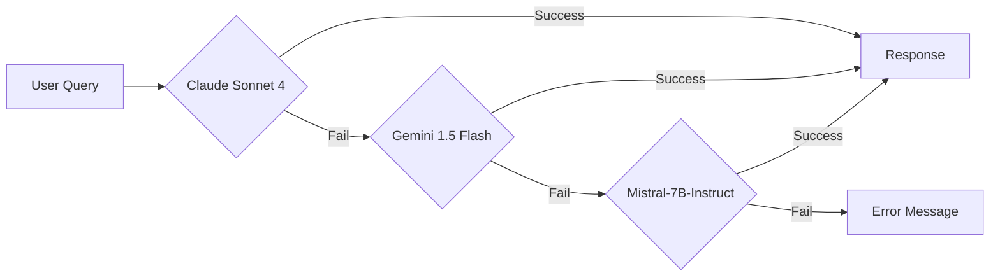

# 01. 기술 스택 (Technology Stack)

> **문서 버전**: v1.0
> **작성일**: 2026-01-05
> **이전 문서**: [00_프로젝트_개요.md](./00_프로젝트_개요.md)
> **다음 문서**: [02_시스템_아키텍처.md](./02_시스템_아키텍처.md)

---

## 📋 목차

1. [프론트엔드 기술 스택](#1-프론트엔드-기술-스택)
2. [백엔드 기술 스택](#2-백엔드-기술-스택-serverless)
3. [AI/ML 기술 스택](#3-aiml-기술-스택)
4. [데이터베이스 스택](#4-데이터베이스-스택)
5. [벡터 저장 스택](#5-벡터-저장-스택)
6. [CI/CD 스택](#6-cicd-스택)
7. [개발 도구](#7-개발-도구)
8. [의존성 설치 가이드](#8-의존성-설치-가이드)

---

## 1. 프론트엔드 기술 스택

### 1.1 핵심 프레임워크 및 라이브러리

| 카테고리 | 기술 | 버전 | 용도 | 선택 이유 |
|---------|------|------|------|----------|
| **Framework** | React | 19+ | UI 컴포넌트 라이브러리 | 최신 버전, 성능 최적화, 생태계 풍부 |
| **Build Tool** | Vite | 5+ | 개발 서버, 번들링 | 빠른 빌드 속도, ESM 기반, HMR 지원 |
| **Language** | TypeScript | 5+ | 타입 안전성 | 타입 체킹, IDE 지원, 유지보수성 |
| **Styling** | PandaCSS | latest | CSS-in-JS | 타입 안전, 제로 런타임, 빌드 타임 생성 |
| **Router** | React Router | 6+ | 페이지 라우팅 | SPA 라우팅, 표준 라이브러리 |

### 1.2 상태 관리

| 카테고리 | 기술 | 용도 | 선택 이유 |
|---------|------|------|----------|
| **Client State** | Jotai | UI 상태 관리 (토글, 필터 등) | 경량, atomic 설계, React 19 호환 |
| **Server State** | TanStack Query | 서버 데이터 캐싱 및 동기화 | 자동 캐싱, 재시도, 백그라운드 업데이트 |

**상태 관리 전략**:
```typescript
// Client State (Jotai) - UI 전용
export const sidebarOpenAtom = atom(false);
export const searchQueryAtom = atom('');

// Server State (TanStack Query) - API 데이터
export const useQAHistory = () => {
  return useQuery({
    queryKey: ['qaHistory'],
    queryFn: fetchQAHistory,
    staleTime: 60000, // 1분 캐시
  });
};
```

### 1.3 UI 컴포넌트 및 시각화

| 카테고리 | 기술 | 용도 |
|---------|------|------|
| **Charts** | Recharts | 대시보드 차트 (Line, Pie, Bar) |
| **Icons** | (커스텀 SVG) | 아이콘 컴포넌트 |

---

## 2. 백엔드 기술 스택 (Serverless)

### 2.1 런타임 및 언어

| 카테고리 | 기술 | 버전 | 용도 | 선택 이유 |
|---------|------|------|------|----------|
| **Runtime** | Node.js | 20+ | JavaScript 실행 환경 | Vercel Serverless 기본 런타임 |
| **Language** | TypeScript | 5+ | 타입 안전성 | 타입 체킹, 프론트/백엔드 일관성 |
| **Module System** | ESM | - | 모듈 시스템 | 최신 표준, tree-shaking 지원 |

### 2.2 Serverless 플랫폼

| 카테고리 | 기술 | 비용 | 제약 | 용도 |
|---------|------|------|------|------|
| **Hosting** | Vercel Serverless Functions | 무료 (Hobby) | 10초 timeout, 1024MB memory | API 엔드포인트 최대 15개 배포 |
| **API** | Vercel File-based Routing | 무료 | - | `api/` 디렉토리 기반 자동 라우팅 |

**Vercel Serverless Functions 특징**:
- ✅ 상시 실행 서버 불필요
- ✅ 요청 시에만 실행 (Cold Start 있음)
- ✅ 자동 스케일링
- ✅ GitHub 연동 자동 배포

### 2.3 API 엔드포인트 구조

```
api/
├── _lib/                    # 공유 유틸리티 (CORS, 에러 핸들링)
├── ask.ts                   # POST /api/ask
├── health.ts                # GET /api/health
├── migration.ts             # GET /api/migration
├── history/
│   ├── index.ts             # GET /api/history
│   ├── [id].ts              # GET /api/history/:id
│   └── session/
│       └── [sessionId].ts   # GET /api/history/session/:sessionId
└── dashboard/
    ├── summary.ts           # GET /api/dashboard/summary
    ├── daily.ts             # GET /api/dashboard/daily
    ├── categories.ts        # GET /api/dashboard/categories
    └── sources.ts           # GET /api/dashboard/sources
```

---

## 3. AI/ML 기술 스택

### 3.1 임베딩 모델 (CI 전용)

```yaml
Model: sentence-transformers/all-MiniLM-L6-v2
Provider: Hugging Face Transformers
Dimensions: 384
Language: Multilingual (한국어 포함)
Cost: 무료 (로컬 실행)
Environment: GitHub Actions Runner + 로컬 개발
```

**특징**:
- ✅ CI 단계에서만 실행 (런타임 불가)
- ✅ 경량화된 모델 (빠른 처리 속도)
- ✅ 다국어 지원 (한국어 포함)
- ✅ 384차원 벡터 (검색 속도 최적화)

**사용 예시**:
```typescript
import { pipeline } from '@xenova/transformers';

// 임베딩 생성 (CI 환경에서만 실행)
const extractor = await pipeline(
  'feature-extraction',
  'sentence-transformers/all-MiniLM-L6-v2'
);

const embedding = await extractor(text, {
  pooling: 'mean',
  normalize: true,
});
```

### 3.2 응답 생성 LLM (Fallback Chain)

#### 3.2.1 Fallback 우선순위



#### 3.2.2 LLM 비교

| 순위 | LLM | Provider | 비용 | 품질 | 사용 목적 | 예상 사용률 |
|------|-----|----------|------|------|----------|------------|
| **1순위** | Claude Sonnet 4 | Anthropic | $3/1M input tokens | ★★★★★ | 고품질 응답 필요 시 | 60% |
| **2순위** | Gemini 1.5 Flash | Google | 무료 (15 RPM) | ★★★★☆ | 일반 질문 처리 | 35% |
| **3순위** | Mistral-7B-Instruct | Hugging Face | 무료 | ★★★☆☆ | 긴급 fallback | 5% |

**비용 최적화 전략**:
- Claude 사용 최소화 → 월 $5 이하 유지
- Gemini Free tier 우선 활용 (15 RPM 제한)
- Mistral은 최종 안전망

---

## 4. 데이터베이스 스택

### 4.1 Primary Database

```yaml
Service: Supabase
Database: PostgreSQL 15+
Extension: pgvector (벡터 검색)
Tier: Free Tier ($0/month)
Region: Asia Pacific (Singapore)
```

**용도**:
- ✅ Q&A 원문 저장 (`qa_history` 테이블)
- ✅ 임베딩 벡터 임시 저장 (CI 단계 전용, `embeddings` 테이블)
- ✅ Ping 기록 (`ping` 테이블 - Free Tier 유지)

### 4.2 Supabase Free Tier 제약

| 항목 | 제한 | 대응 방안 |
|------|------|----------|
| **Database Size** | 500 MB | 주기적 데이터 정리, 벡터 파일 export |
| **Bandwidth** | 5 GB/month | 읽기 최소화, 캐시 활용 |
| **API Requests** | Unlimited | 제한 없음 |
| **Inactivity Pause** | 7일 | Supabase Ping (주간 자동 실행) |

### 4.3 Supabase 테이블 스키마 (요약)

```sql
-- Q&A 히스토리 저장
CREATE TABLE qa_history (
  id UUID PRIMARY KEY DEFAULT uuid_generate_v4(),
  question TEXT NOT NULL,
  answer TEXT NOT NULL,
  category TEXT,
  sources JSONB,
  session_id TEXT,
  created_at TIMESTAMPTZ DEFAULT now()
);

-- 임베딩 벡터 임시 저장 (CI 전용)
CREATE TABLE embeddings (
  id TEXT PRIMARY KEY,
  type TEXT NOT NULL,
  content TEXT NOT NULL,
  embedding vector(384),
  metadata JSONB,
  created_at TIMESTAMPTZ DEFAULT now()
);

-- Ping 테이블 (Free Tier 유지)
CREATE TABLE ping (
  id UUID PRIMARY KEY DEFAULT uuid_generate_v4(),
  pinged_at TIMESTAMPTZ DEFAULT now()
);
```

---

## 5. 벡터 저장 스택

### 5.1 File-Based Vector Store (Production)

```yaml
Storage: GitHub Repository
Format: embeddings.json.gz (gzip 압축)
Location: output/ 디렉토리
Access: GitHub Raw URL
Cost: $0 (CDN 비용 없음)
```

**GitHub Raw URL 예시**:
```
https://raw.githubusercontent.com/username/NLP-portfolio/main/output/embeddings.json.gz
```

**장점**:
- ✅ CDN 비용 없음
- ✅ Git 버전 관리 (자동 백업)
- ✅ 배포 간단 (Git push만)

**단점**:
- ❌ 파일 크기 제한 (100MB)
- ❌ 실시간 업데이트 불가 (CI 주기에 의존)

### 5.2 Vector File 구조

```typescript
interface EmbeddingFile {
  version: string;              // "1.0.0"
  generatedAt: string;          // ISO 8601
  statistics: {
    totalEmbeddings: number;
    commitCount: number;
    fileCount: number;
    qaCount: number;
  };
  embeddings: EmbeddingItem[];
}

interface EmbeddingItem {
  id: string;                   // "commit-{sha}" | "file-{sha}-{index}" | "qa-{id}"
  type: "commit" | "file" | "qa";
  content: string;              // 원본 텍스트
  embedding: number[];          // [384] dimensions
  metadata: Record<string, any>;
}
```

---

## 6. CI/CD 스택

### 6.1 GitHub Actions

| 워크플로우 | 실행 주기 | 용도 | 예상 실행 시간 |
|-----------|----------|------|---------------|
| **Unified Embedding Pipeline** | 매주 토요일 18:00 UTC | GitHub 데이터 수집 + 임베딩 + export | 15-30분 |
| **Supabase Ping** | 매주 일요일 24:00 KST | Free Tier 유지 | 1분 |

**GitHub Actions Free Tier**:
- ✅ 2,000분/월 무료
- ✅ Public 레포지토리 무제한
- ✅ Artifacts 90일 보관

### 6.2 Vercel Deployment

| 항목 | 설정 | 비용 |
|------|------|------|
| **Plan** | Hobby (Free) | $0/month |
| **Builds** | GitHub 연동 자동 배포 | 무료 (무제한) |
| **Bandwidth** | 100 GB/month | 무료 |
| **Function Execution** | 100 GB-Hours/month | 무료 |

---

## 7. 개발 도구

### 7.1 패키지 관리

```yaml
Package Manager: pnpm (v10.17.1+)
Lockfile: pnpm-lock.yaml
Node Version: 20+ (LTS)
```

**pnpm 선택 이유**:
- ✅ 디스크 공간 절약 (hard links)
- ✅ 빠른 설치 속도
- ✅ Strict dependency resolution

### 7.2 코드 품질 도구

| 도구 | 용도 | 설정 파일 |
|------|------|----------|
| **ESLint** | 코드 린팅 | `eslint.config.js` |
| **TypeScript** | 타입 체킹 | `tsconfig.json` |
| **Prettier** | 코드 포맷팅 | `.prettierrc` (선택) |

### 7.3 IDE 추천 설정 (VS Code)

```json
// .vscode/settings.json
{
  "editor.formatOnSave": true,
  "editor.codeActionsOnSave": {
    "source.fixAll.eslint": true
  },
  "typescript.tsdk": "node_modules/typescript/lib",
  "typescript.enablePromptUseWorkspaceTsdk": true
}
```

---

## 8. 의존성 설치 가이드

### 8.1 필수 의존성 (dependencies)

```json
{
  "@anthropic-ai/sdk": "^0.71.2",           // Claude API
  "@google/generative-ai": "^0.24.1",       // Gemini API
  "@octokit/rest": "^22.0.1",               // GitHub API
  "@supabase/supabase-js": "^2.87.1",       // Supabase 클라이언트
  "@tanstack/react-query": "^5.90.12",      // 서버 상태 관리
  "@xenova/transformers": "^2.17.2",        // HuggingFace 임베딩
  "dotenv": "^17.2.3",                      // 환경 변수
  "jotai": "^2.16.0",                       // 클라이언트 상태
  "openai": "^6.10.0",                      // OpenAI API (쿼리 임베딩용)
  "react": "^19.2.0",                       // React 프레임워크
  "react-dom": "^19.2.0",
  "react-router-dom": "^7.10.1",            // SPA 라우팅
  "recharts": "^3.5.1",                     // 차트 라이브러리
  "uuid": "^13.0.0"                         // UUID 생성
}
```

### 8.2 개발 의존성 (devDependencies)

```json
{
  "@pandacss/dev": "^1.7.0",                // PandaCSS
  "@types/node": "^24.10.1",
  "@types/react": "^19.2.5",
  "@types/react-dom": "^19.2.3",
  "@vercel/node": "^5.5.16",                // Vercel Serverless 타입
  "@vitejs/plugin-react": "^5.1.1",
  "eslint": "^9.39.1",
  "tsx": "^4.21.0",                         // TypeScript 실행기
  "typescript": "^5.9.3",
  "vercel": "^50.1.3",                      // Vercel CLI
  "vite": "^7.2.4"
}
```

### 8.3 설치 명령어

```bash
# pnpm 설치 (없는 경우)
npm install -g pnpm

# 프로젝트 의존성 설치
pnpm install

# 개발 서버 실행 확인
pnpm run dev:frontend  # 프론트엔드 (포트 5173)
pnpm run server        # API 서버 (포트 3001)
```

---

## 9. 다음 단계

기술 스택을 이해했다면, 다음 문서로 진행하세요:

👉 **[02_시스템_아키텍처.md](./02_시스템_아키텍처.md)** - 시스템 구조 및 데이터 흐름 이해

---

## 10. 관련 문서

- [프로젝트 기획서 - 기술 스택 섹션](../01_planning/00_Product_Plan.md#3-기술-스택)
- [환경 변수 설정](../02_architecture/02_Environment_Variables.md)
- [CLAUDE.md - Tech Stack](../../CLAUDE.md#project-overview)

---

**문서 작성 완료**: 2026-01-05
**이전 문서**: [00_프로젝트_개요.md](./00_프로젝트_개요.md)
**다음 문서**: [02_시스템_아키텍처.md](./02_시스템_아키텍처.md)
