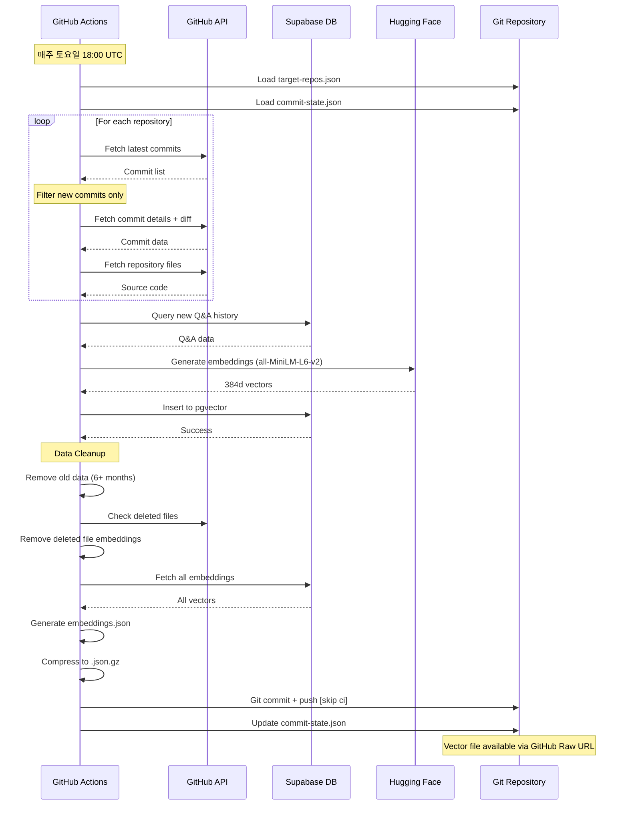
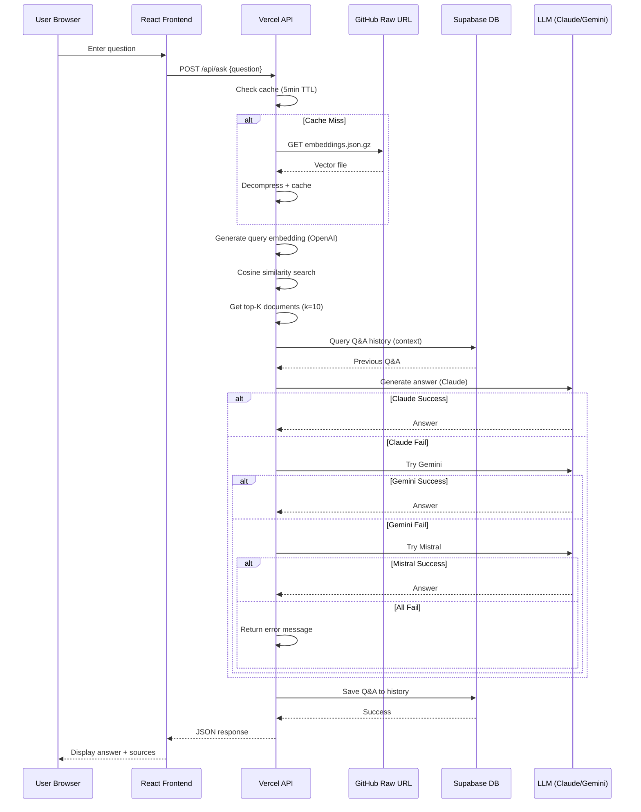

# 02. 시스템 아키텍처

> **문서 버전**: v1.0
> **작성일**: 2026-01-05
> **이전 문서**: [01_기술_스택.md](./01_기술_스택.md)
> **다음 문서**: [03_환경_설정.md](./03_환경_설정.md)

---

## 📋 목차

1. [전체 시스템 구성도](#1-전체-시스템-구성도)
2. [설계 원칙](#2-설계-원칙)
3. [데이터 흐름](#3-데이터-흐름)
4. [컴포넌트 아키텍처](#4-컴포넌트-아키텍처)
5. [배포 아키텍처](#5-배포-아키텍처)

---

## 1. 전체 시스템 구성도

```
┌─────────────────────────────────────────────────────────────────┐
│                        GitHub Actions (CI)                       │
│  ┌──────────────────────────────────────────────────────────┐   │
│  │ Unified Embedding Pipeline (주간 자동 실행)              │   │
│  │  1. target-repos.json 로드                               │   │
│  │  2. GitHub API → 커밋 + diff + 파일 수집                │   │
│  │  3. Supabase → Q&A 히스토리 조회                        │   │
│  │  4. Hugging Face 임베딩 생성 (384d)                     │   │
│  │  5. Supabase pgvector 저장                               │   │
│  │  6. 데이터 정리 (6개월 이상, 삭제된 파일)               │   │
│  │  7. embeddings.json.gz 생성                              │   │
│  │  8. Git commit & push [skip ci]                          │   │
│  └──────────────────────────────────────────────────────────┘   │
└─────────────────────────────────────────────────────────────────┘
                              │
                              │ Git Push
                              ▼
┌─────────────────────────────────────────────────────────────────┐
│                    GitHub Repository (Storage)                   │
│  ┌──────────────────────────────────────────────────────────┐   │
│  │ output/embeddings.json.gz                                │   │
│  │  - 정적 벡터 파일 (gzip 압축)                           │   │
│  │  - GitHub Raw URL 제공                                   │   │
│  │  - CDN 비용 없음                                         │   │
│  └──────────────────────────────────────────────────────────┘   │
└─────────────────────────────────────────────────────────────────┘
                              │
                              │ HTTPS GET (GitHub Raw URL)
                              ▼
┌─────────────────────────────────────────────────────────────────┐
│               Vercel Serverless (Runtime)                        │
│  ┌──────────────────────────────────────────────────────────┐   │
│  │ API Server (15 Serverless Functions)                     │   │
│  │  - POST /api/ask                                         │   │
│  │  - GET /api/health                                       │   │
│  │  - GET /api/history                                      │   │
│  │  - GET /api/dashboard/*                                  │   │
│  └──────────────────────────────────────────────────────────┘   │
│  ┌──────────────────────────────────────────────────────────┐   │
│  │ Vector Search Engine (File-based)                        │   │
│  │  1. embeddings.json.gz 로드 (메모리 캐시 5분)           │   │
│  │  2. OpenAI 쿼리 임베딩 생성                             │   │
│  │  3. Brute-force Cosine Similarity                        │   │
│  │  4. Top-K 문서 반환 (k=10)                              │   │
│  └──────────────────────────────────────────────────────────┘   │
│  ┌──────────────────────────────────────────────────────────┐   │
│  │ LLM Fallback Chain                                       │   │
│  │  Claude Sonnet 4 → Gemini 1.5 Flash → Mistral-7B        │   │
│  └──────────────────────────────────────────────────────────┘   │
└─────────────────────────────────────────────────────────────────┘
                              │
                              │ JSON Response
                              ▼
┌─────────────────────────────────────────────────────────────────┐
│                   React Frontend (Vite + Vercel)                │
│  ┌──────────────────────────────────────────────────────────┐   │
│  │ Pages                                                    │   │
│  │  - / (Q&A Page) - ChatGPT 스타일                        │   │
│  │  - /dashboard (Analytics) - 통계 대시보드               │   │
│  │  - /settings (Server Status) - 서버 상태                │   │
│  └──────────────────────────────────────────────────────────┘   │
│  ┌──────────────────────────────────────────────────────────┐   │
│  │ State Management                                         │   │
│  │  - Jotai (Client State) - UI 토글, 검색어               │   │
│  │  - TanStack Query (Server State) - API 캐싱             │   │
│  └──────────────────────────────────────────────────────────┘   │
└─────────────────────────────────────────────────────────────────┘
```

---

## 2. 설계 원칙

### 2.1 Zero Server Cost (비용 최소화)

**목표**: 월 $0 운영비

**구현 전략**:
- ✅ **상시 실행 서버 없음** → Vercel Serverless Functions 사용
- ✅ **벡터 DB 서버 운영 없음** → 정적 파일 (`embeddings.json.gz`) 사용
- ✅ **CDN 비용 없음** → GitHub Raw URL 활용
- ✅ **캐시 서버 없음** → 메모리 캐시 (5분 TTL)

**비용 계산**:
```
GitHub Actions: 무료 (2,000분/월, 실제 사용: ~120분/월)
Vercel Hosting: 무료 (Hobby Plan)
Supabase: 무료 (Free Tier, Ping으로 유지)
OpenAI API: ~$2-5/월 (쿼리 임베딩 + 답변 생성)
Claude API: ~$3-8/월 (답변 생성, Gemini fallback으로 절감)
──────────────────────────────────────────
총 운영비: ~$5-13/월 (목표: $10 이하)
```

---

### 2.2 CI-First Architecture (CI 중심 설계)

**목표**: 임베딩 생성을 CI 단계로 제한

**구현 전략**:
- ✅ **임베딩은 GitHub Actions에서만 실행** (로컬 개발 제외)
- ✅ **런타임은 읽기 전용 구조** (벡터 파일 로드만)
- ✅ **정적 파일 기반 배포** (Git commit & push)

**CI vs Runtime 역할 분리**:
| 작업 | CI (GitHub Actions) | Runtime (Vercel) |
|------|---------------------|------------------|
| 임베딩 생성 | ✅ | ❌ |
| 벡터 검색 | ❌ | ✅ |
| LLM 답변 생성 | ❌ | ✅ |
| 벡터 파일 저장 | ✅ | ❌ |
| Q&A 히스토리 조회 | ✅ (임베딩용) | ✅ (화면 표시용) |

---

### 2.3 Incremental Update (증분 업데이트)

**목표**: 신규 데이터만 처리하여 비용 절감

**구현 전략**:
- ✅ **commit-state.json으로 중복 방지**
- ✅ **Idempotent 처리** (재실행 안전성)
- ✅ **GitHub Actions Artifacts 활용** (90일 보관)

**commit-state.json 구조**:
```json
{
  "version": "2.0",
  "repositories": {
    "owner/repo": {
      "lastCommitSha": "abc123...",
      "lastTreeSha": "def456...",
      "lastUpdated": "2026-01-05T10:00:00Z"
    }
  },
  "lastQATimestamp": "2026-01-05T10:00:00Z",
  "lastCleanupRun": "2026-01-05T10:00:00Z",
  "lastUpdated": "2026-01-05T10:00:00Z"
}
```

---

## 3. 데이터 흐름

### 3.1 CI Pipeline (Offline - 주간 실행)



---

### 3.2 Runtime Flow (Online - Q&A 요청)



---

## 4. 컴포넌트 아키텍처

### 4.1 프론트엔드 컴포넌트

```
src/
├── App.tsx                     # React Router 설정
├── pages/
│   ├── QAPage.tsx              # Q&A 페이지 (/)
│   ├── DashboardPage.tsx       # 대시보드 (/dashboard)
│   └── SettingsPage.tsx        # 설정 (/settings)
├── components/
│   ├── common/
│   │   └── ServerStatus.tsx    # 헤더 상태 표시
│   ├── qa/
│   │   ├── MessageList.tsx     # 메시지 목록
│   │   ├── InputBox.tsx        # 질문 입력
│   │   └── SourceCard.tsx      # 소스 인용
│   └── dashboard/
│       ├── StatsCard.tsx       # 통계 카드
│       └── Chart.tsx           # Recharts 래퍼
├── hooks/
│   └── useQueries.ts           # TanStack Query hooks
├── stores/
│   └── uiStore.ts              # Jotai atoms
├── api/
│   └── client.ts               # API 클라이언트
└── types/
    └── index.ts                # TypeScript 타입
```

---

### 4.2 백엔드 API 엔드포인트

```
api/
├── _lib/                       # 공유 유틸리티
│   ├── cors.ts                 # CORS 설정
│   ├── errorHandler.ts         # 에러 핸들링
│   ├── responseFormatter.ts    # 응답 포맷팅
│   └── healthCheck.ts          # Health check 로직
├── ask.ts                      # POST /api/ask
├── health.ts                   # GET /api/health
├── migration.ts                # GET /api/migration
├── history/
│   ├── index.ts                # GET /api/history
│   ├── [id].ts                 # GET /api/history/:id
│   └── session/
│       └── [sessionId].ts      # GET /api/history/session/:sessionId
└── dashboard/
    ├── summary.ts              # GET /api/dashboard/summary
    ├── daily.ts                # GET /api/dashboard/daily
    ├── categories.ts           # GET /api/dashboard/categories
    └── sources.ts              # GET /api/dashboard/sources
```

---

### 4.3 공유 라이브러리 (Shared)

```
shared/
├── lib/
│   ├── supabase.ts             # Supabase 클라이언트
│   └── supabaseMigration.ts    # DB 마이그레이션
├── services/
│   ├── qa/
│   │   ├── answer.ts           # LLM 답변 생성
│   │   └── classifier.ts       # 질문 분류
│   └── vector-store/
│       ├── fileVectorStore.ts  # 파일 기반 벡터 검색
│       ├── embeddingService.ts # 임베딩 생성
│       └── qaHistoryVectorStore.ts # Q&A 히스토리 벡터
└── models/
    ├── EmbeddingItem.ts        # 임베딩 아이템 타입
    └── SearchResult.ts         # 검색 결과 타입
```

---

## 5. 배포 아키텍처

### 5.1 프로덕션 환경

```
┌─────────────────────────────────────────────────────────┐
│                    Production Env                        │
│                                                          │
│  ┌────────────────┐         ┌────────────────┐          │
│  │ Vercel CDN     │◄────────│ GitHub Pages   │          │
│  │ (Frontend)     │         │ (Static Assets)│          │
│  └────────────────┘         └────────────────┘          │
│          │                                               │
│          ▼                                               │
│  ┌────────────────┐         ┌────────────────┐          │
│  │ Vercel Edge    │◄────────│ GitHub Raw URL │          │
│  │ (Serverless)   │         │ (Vector File)  │          │
│  └────────────────┘         └────────────────┘          │
│          │                                               │
│          ▼                                               │
│  ┌────────────────┐         ┌────────────────┐          │
│  │ Supabase       │         │ Claude/Gemini  │          │
│  │ (Database)     │         │ (LLM APIs)     │          │
│  └────────────────┘         └────────────────┘          │
└─────────────────────────────────────────────────────────┘
```

### 5.2 환경별 URL

| 환경 | Frontend | API | Vector File |
|------|----------|-----|-------------|
| **Local** | http://localhost:5173 | http://localhost:3001 | `output/embeddings.json.gz` (로컬 파일) |
| **Production** | https://nlp-portfolio.vercel.app | https://nlp-portfolio.vercel.app/api | GitHub Raw URL |

---

## 6. 다음 단계

시스템 아키텍처를 이해했다면, 다음 문서로 진행하세요:

👉 **[03_환경_설정.md](./03_환경_설정.md)** - 개발 환경 준비

---

## 7. 관련 문서

- [시스템 아키텍처 상세 설계](../02_architecture/01_System_Architecture.md)
- [데이터 흐름](../../CLAUDE.md#data-flow)

---

**문서 작성 완료**: 2026-01-05
**이전 문서**: [01_기술_스택.md](./01_기술_스택.md)
**다음 문서**: [03_환경_설정.md](./03_환경_설정.md)
